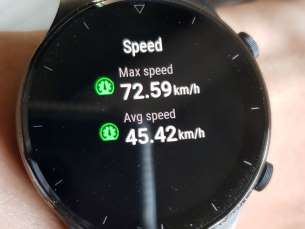

Yujia, Eddie, Dorene, and I made a quick weekend trip up to Big Bear, CA. We spent the first day at Bear Mountain. I decided to start learning how to hit the bigger jumps. It's not 100 percent consistent, but I think I've managed to get a bit better. I even hit some of the giant ramps, though I'm not getting enough air to clear the landing...

Conditions on the first day were amazing! I was surprised, given that the forecast was for temperatures in the sixties. The slopes started off a bit icy in the morning, but within an hour or two, they grew to be arguably ideal.

The second day, we hit up Snow Summit. It was Super Bowl Sunday, so we figured that Snow Summit would be less crowded. We had to wait a maximum of 5 minutes for any given lift, which made it easy to keep riding and minimize idling. Unfortunately, it was pretty sunny and conditions were quite poor. 

Trying to make lemonade from lemons, Yujia and I attempted to set our maximum speed records. We picked an icy blue or black (I can't remember), and full-commit booked it down the slope. Yujia reached a max speed of about 61 kmh (38 mph). On my first attempt, I reached 69 kmh (43 mph) before catching an edge and wiping out. My elbow and back got scraped up pretty bad, and my elbow in particular was bleeding quite a bit. Regardless, I decided to try again. My second attempt, I reached a maximum speed of 72.59 kmh (45 mph). I was pretty happy with the result. Next time, I'll try bigger jumps and faster runs!

