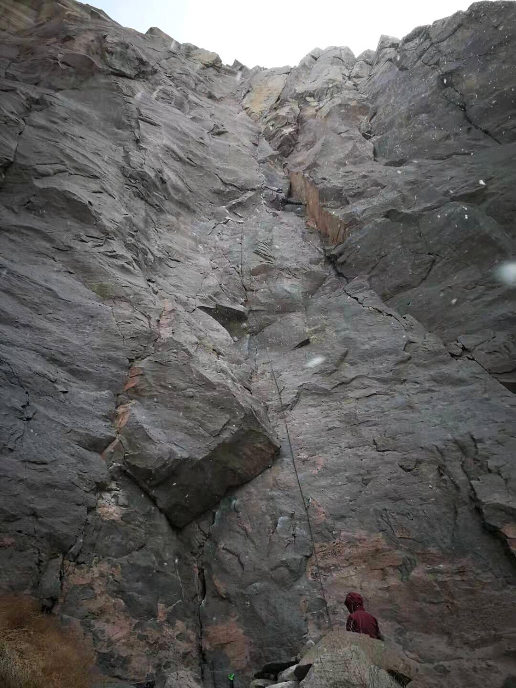

Day 1
--------
We arrived at Bishop, CA and immediately headed over to the Buttermilks. We only had a half-day, but we knew there wasn't much for us at the Buttermilks anyways. After a few VB and V0 warmups, we slowly made our way through some V0/1's. I don't recall any names except Hero Roof (V0) since most of the problems weren't very memorable. 

A year ago, I had worked the moves on Iron Man Traverse (V4) and nearly finished the problem. At the time, I only needed to stick the big last move to complete the boulder. This time, I could barely do four consecutive moves in a row. Seems that quarantine has taken its toll.

We finished the day at the Womb and took a picture at the Grandpa Peabody.

Day 2
-------
During our second day in Bishop, we decided to try our hand at some sport climbing in Owens River Gorge. We headed to the Dihedrals area, where the original plan was to try Gangsta Lean (T 5.8), O.R.G.asm (S 5.11a), and some cracks if there was time. I started the day off by onsighting Gangsta Lean. The fantastic movement and great protection on the route made for a good time. Unfortunately, there was another group projecting O.R.G.asm, so I didn't have time to give it a try. 

Instead, I spent the rest of the day working on Not Proud Enough to Name (T 5.8). I am still new to crack climbing, so this route initially kicked my ass. I initially tried it on lead, but was so pumped half way through that I placed the sketchiest cam I ever hope to place in my life and rested. I lowered after backing up the cam. 

To get my gear back, I climbed some arete (S 5.10a) next to the crack and lowered on the anchors. This also allowed me to try the crack again on top rope. Once I locked down the beta, I tried the route again on lead. My movement and placements were significantly more efficient, and I was able to send the route.

That day, Yujia sent Gangsta Lean (TR), To Proud to Name (TR), and some other lieback (S 5.6).

Day 3
-------
We wanted a full day of bouldering on routes that Yujia and Amy could do, so we headed to the Happys on day three. The goal was for Yujia and Amy to try some easier boulders, then for me to try Serengeti.

We started on Heavenly Path boulder, where Yujia and Amy sent a couple of highballs. I only did Celestial Trail (V0-) and Heavenly Path (V1). 

After Heavenly Path boulder, we went to Serengeti boulder. My goal was to send Serengeti (V5). I guess there are dozens of variations for the problem (which I think makes the problem less elegant than others). I ended up going with a toe-hook variation that throws me right towards a pocket, skipping nearly all the sloper holds. I sent the problem, but some people mentioned that this variation is graded at V4. Whatever, I'm proud of my beta and my send!  



We spent the rest of the day tried whatever boulder problem looked interesting. Yujia and Amy sent a handful of V0's and V1-'s. My personal favorites from this second half of the day were Slight Inducement (V1) and I Killed a Man (V1). 

After the Happys, we grabed dinner and beer at the Mountain Rambler Brewery. Their Scottish Ale blew me away, and we met some residents who were friendly enough to chat about neuroscience and real estate in Bishop! This might have been my favorite day of the whole trip, despite my preference for sport climbing over bouldering.

Day 4
-------
On the last day of the trip, we headed back to Owens River Gorge for more sport climbing. It was absolutely freezing this day. There was actually snow coming down in the middle of the day, and we were completely unprepared for the frigid weather. 

After warming up, I hopped straight onto my project, Grindrite (S 5.11b). It ascends this incredible line up a sea of dark grey stone and has a mixture of lieback and face climbing. Unfortunately, my failed onsight attempt took 45 minutes, and it was too cold in the shade for a second try. I made it to the crux, but was unable to reach a jug which felt exceptionally far away. It required either a lock-off strength in my right arm that I simply do not have or a dynamic move off of tiny feet and a poor right crimp. I managed to climb around the crux by moving right onto a 5.10a. The transition into the other route and later back onto Grindrite was quite difficult itself. 

After Grindrite, we moved to a new location in an attempt to find some sunshine. Yujia and Amy climbed some crack feature (S 5.6), and then we all sent Cinderella (T 5.9). Cinderella was actually quite challenging due to some technical movement, and I thoroughly enjoyed the whole route.

By the end of the day, the temperature had dropped to freezing levels, the wind was roaring, and rocks were showering down on us from the cliff above. I think it was the gorge telling us to call it a trip and go home. We packed up our things and headed home that day. On our way back, I snagged a quick picture of the clouds coming over the Sierra Nevada. What a view.

P.S. Almost forgot! We stopped by Death Valley on the ride home!

