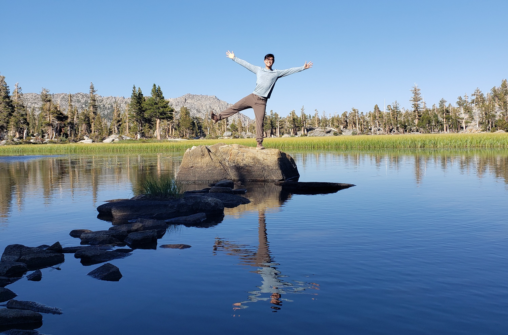
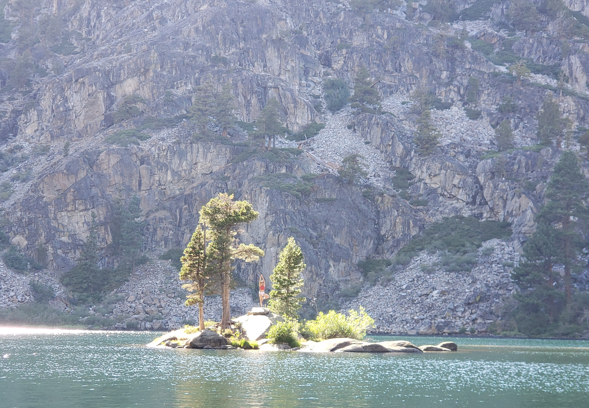

Yujia and I spent 3 days on a loop through Desolation Wilderness, Lake Tahoe. We visited Granite Lake, Dick's Lake, Velma Lake, and Eagle Lake. I think my fondest memory of this backpacking trip was camping next to Eagle Lake and swimming out to the island in the center.

