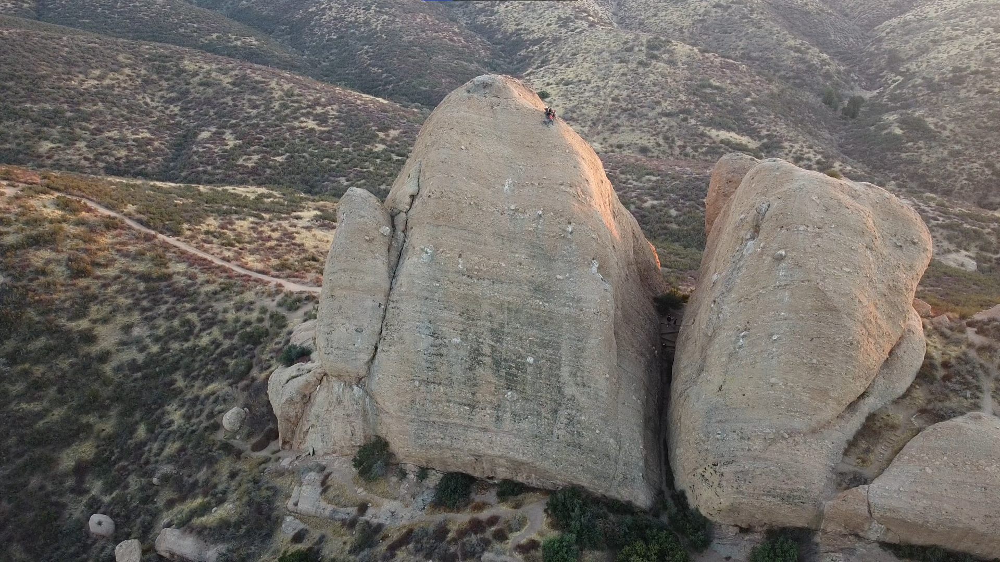
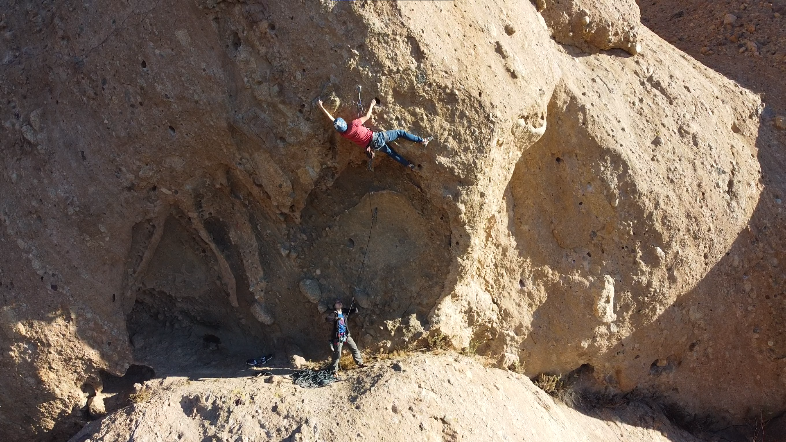

The idea
--------
Yujia and I were taking Kate and Chen out to Texas Canyon to teach them how to multipitch. We took them up Tethys (S 5.7, 2 pitches) on the 26th and accidentally got Kai's rope stuck during the rappel. Normally, we'd just use our second rope to climb back up and free it from the point where it was jammed, but it was late at night. We decided the prudent thing to do was to leave it and come back the next day.

 

Before hopping on the multipitch on the 26th, each of us tried our own projects elsewhere at Texas Canyon. Yujia and the others tried some 5.10a's and 5.10b's near the Egg. I had been looking through Mountain Project and found a route called Eager Beaver (S 5.12a) that looked particularly enticing. It looked like there was a short roof section, a dyno out of the roof to a jug, and then some face climbing to finish off the route. Each of these aspects sounded interesting to me. 

The process
------
I worked the route with Mr. Song, figuring out the beta for all the moves leading up to the face climb. The route had two cruxes, the dyno out of the roof and the start of the face climb. I was completely stumped by the second crux as it required a high, insecure foot and a sidepull on a sloped (chossy) pocket. Mr. Song found a way to use the sidepull sloper pocket to crunch up, get his right foot onto a big bulge, and stand up on the foot. After that, we both knew the route was doable.

Unfortunately, both Mr. Song and I could not complete the route on the first day. Mr. Song seemed to be comfortable with the latter half of the route, but couldn't repeat his moves through the first crux. I was comfortable with the first half of the route, but couldn't pull through the second crux.

The send
-------
Upon coming back for Kai's rope on the 27th, I decided to give Eager Beaver a few more tries. My fingers and shoulders were pretty sore from the day before, and my skin was in mediocre condition at best. I knew that if the send was to happen, it would have to happen within the first few tries. 

On the first attempt, I was climbing through the roof section but was short roped as I was clipping. I burned a lot of energy in an uncomfortable position to wait while Yujia tried to loosen up the grigri and give some slack in the rope. I decided to lower and try again after some rest.

On the second attempt, I had Kate belay me with an ATC. There was a light breeze, and I could feel the ripples in my shirt gently traverse my torso. I have a point on my harness that I stare at when I get nervous about climbing, so I stared at this spot for a few seconds and focused on my breathing. When I felt ready, I took off and raced through the roof section. I managed to pull out of the roof section statically instead of employing the dyno beta that others seemed to use, saving a lot of energy. When I got to the second crux, my hand actually slipped out of the sloper pocket, but luckily I was in a position to catch myself, reset, and try again. This wasted a bit of energy, but I was still feeling good after cruising through the first half of the route. I pulled hard, got my right foot on top of the bulge, and stood up. At this moment, I knew I was going to send. I had to take a moment to breathe, calm down, and rest my forearms. When it felt like the rest wasn't giving me anymore energy back, I darted to the top and clipped the chains.



This was definitely the hardest route I've sent thusfar. It was a surreal feeling to be hanging off the anchors and taking in the views. The send occurred 363 days after my first 5.10a, so I truly felt like the sky was the limit.