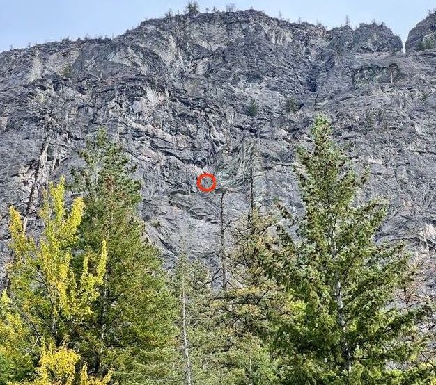
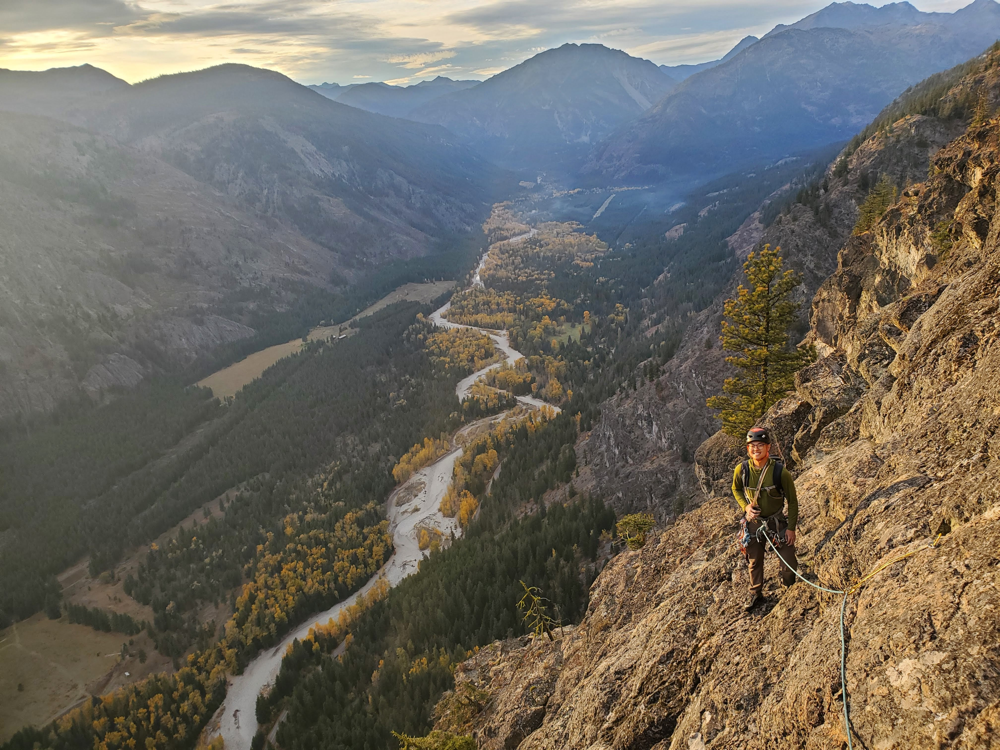
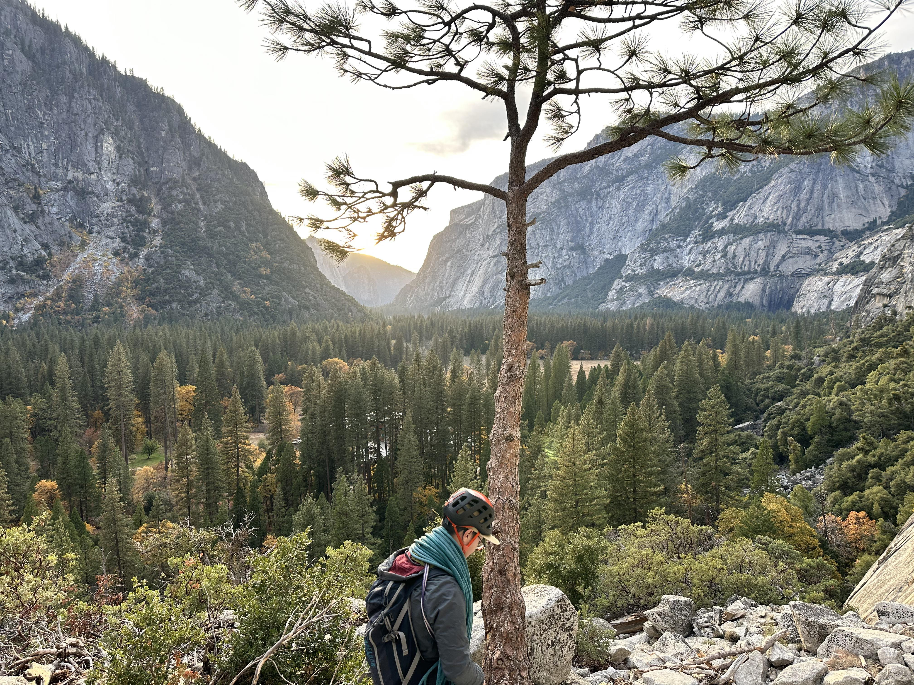
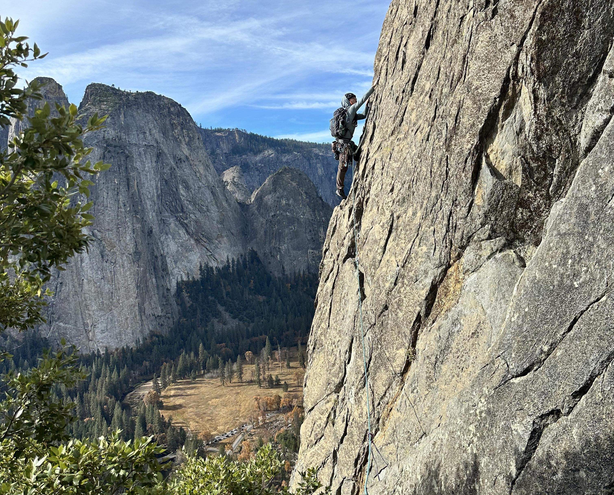
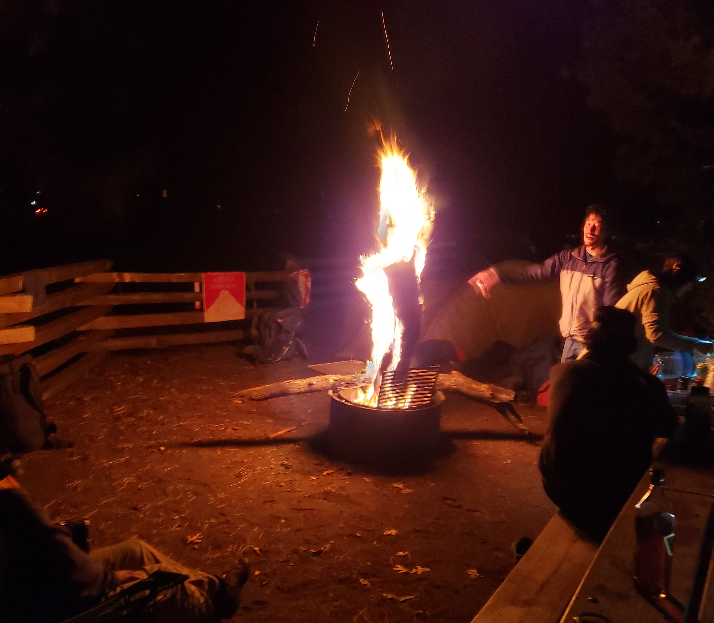
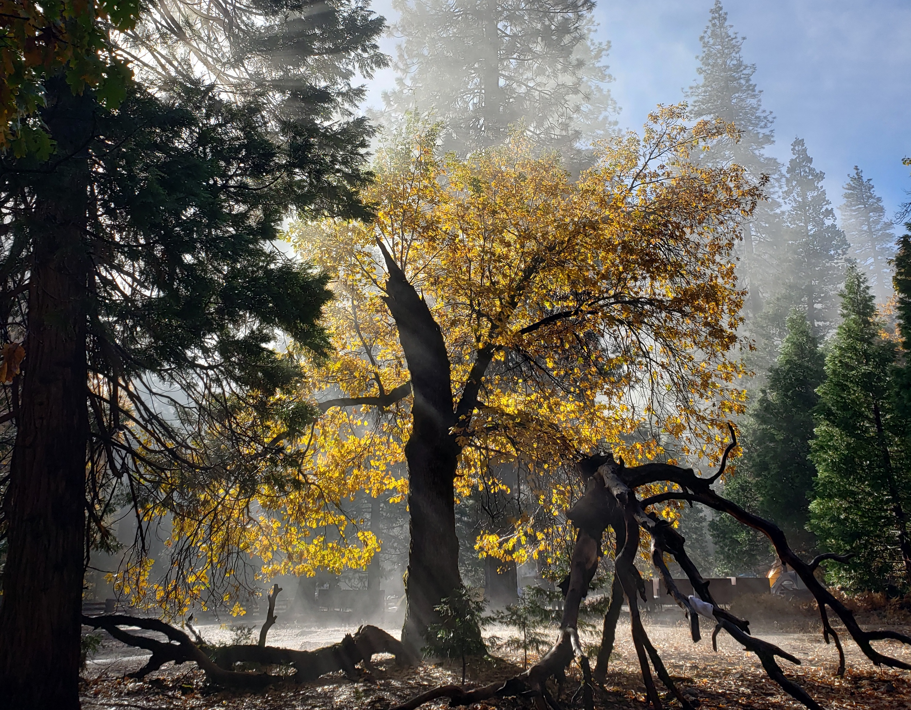

These posts are getting lazier and lazier, but in my defense, I'm nearing the end of my PhD, so things are getting busier. 

During October and November 2023, I had a series of 3 conferences I needed to attend along the west coast, so I decided to combine them all into a road trip. I started off by crashing with Yuping in San Francisco on day 1, then spent the next three days blitzing it north to Seattle with Cindy and Calvin, then Vancouver.

The first conference was Society for Neuroeconomics, always my favorite. Every year, it's like balancing a friend reunion with meeting professors I've always wanted to meet. I gave my first conference talk on the first day to a room of what felt like 200ish people. Very scary, but also a great experience.

After the conference, the plan was to go to Squamish for a few days with Yujia, Cindy, and Calvin, but the weather had other plans. We pivoted to North and Central Washington where the rain was a bit more forgiving. Cindy and I hit Index for one day. Super 3D climbing. The rock is a very nice granite, reminds me of Tahquitz, but the angles of most walls are full vertical. This allows for a lot 3D moves, where you're reaching out in every direction to make progress. Felt like boulder problems stacked on top of each other, hard between rests, but the rests are 100%. I remember doing Godzilla, some stuff underneath Breakfast of Champions, and attempting BoC but getting demolished. Bit too thin and overhung for my hands.

After Index, Yujia and I headed over to Mazama earlier than Cindy and Calvin. We decided to hit Flyboys, an 18 pitch 5.9 sport route. Got up at 4 am with all our gear prepped, dropped off bikes at the summit, then made our way to the base by sunrise. I think Yujia was a bit phased by pitch 1, but I was having an absolute blast. I was in charge of leading every pitch, and so far everything was manageable. Eventually, we reached pitch 7, which some consider the crux. It's an intimidating looking line up a steep wall with a blank bulge in the middle. The move across this bulge was hard, definitely felt closer to a 5.10c crux move at Malibu Creek than a 5.9. That being said, it was only about 3 moves with a rest before and after, so I can see why it'd still be a 5.9. Yujia got stuck there for about 2 hours, and a passing guide helped me haul her up. After that, Yujia was ready to call it, so we rapped, picked up our bikes at the summit, and rode down early. Still a fantastic day.

That night, Cindy, Calvin, and their friend Ethan drove in. Our plan was to hit another multipitch, but then I floated the idea of trying Flyboys again with Ethan. He seemed super stoked about it, so we decided to try again the next morning. Up at 4 again, this time no bikes at the summit, but we would radio Cindy and Yujia when we were done for a lift. Ethan and I agreed that we would mostly swing leads, and I would lead all the crux pitches. We were absolutely flying. We reached pitch 7 within I think 2 hours this time. I led the pitch again, this time trying to be a bit more cogniscent of rope drag. Similar to the day before, Ethan was stuck at the crux for roughly 1.5 hours, but he eventually pulled through. We took a 15 minute break afterwards, but ultimately decided to continue on! The next pitch was an overhanging flake with full exposure around the side of a small buttress. It was a bit pumpy, but honestly an incredible pitch, albeit a bit scary with all the exposure. We continued on, and even simuled some of the easy slab, until we reached what I believe is pitch 14... the chimney. Holy cow did this pitch look scary. It's huge, you have to traverse over a highly exposed bridge to get to the start, and getting into the chimney looked overhung and hard. While pitch 7 was probably the hardest overall pitch, I think this pitch had the single hardest move. Getting into the chimney, you need to pull over a diagonal overhung ledge with sloper holds. I honestly felt like the move was closer to a 5.11a crux move, but again, only 1 move with good rests right before and after. After that pitch, Ethan and I felt invincible. Nothing was gonna stop us at that point.

The second to last pitch was a cruiser 5.7 with high exposure. Easy moves around another buttress, which we hit right at sunset, golden hour. The view was unbelievable, everything a shade of gold, the climbing secure, the exposure maximum. Hard to put the moment into words. Sublime. I think this was the money pitch given the time of day we hit it at. The valley below looked like an artist took beige, yellow, and green brushes and squiggled a line down the middle. 

After Mazama, I had another conference in Seattle. It was my first marketing conference, and it was quite difference from what I was used to. Had a great time making new friends and exploring a new field.

My next destination was a conference in San Francisco, but I had a bit more than 2 weeks until then. I made my way towards Yosemite, stopping at a few national parks along the way. I wont name them all, but two locations left a lasting impression. Crater Lake in Oregon was unbelieveable, like a island ring in the sky. Truly magical.

The second was Lava Beds National Monument. They're these beds of rock that form underground caves along the northern border of California. I went solo caving in a few of them, like Gold Dome. Absolutely terrifying being along in the pitch black, but I challenged myself to at least make it to one of the rooms with the ceiling covered in gold-like minerals. I drove away proud that I stuck through the fear. Definitely feel like the place would be a lot more fun with a group of friends though.

I met up with Kai in Camp 4 of Yosemite in early November. We planned to stay there for 2 weeks and climb as much as we can.

Day 1, we hit The Grack and Haley Daley, which is the photo featured for this post. We're looking pretty clean and fresh in this picture, definitely not how we looked and felt by day 14. Despite feeling secure on both, we felt the need to acclimate to the slippery granite in Yosemite and up our thin crack technique before committing to anything huge. In the next few days, we did Swan Slab (in the rain), Nutcracker (pitch was was freaking hard and slippery!), worked Generator Crack (I topped out with a few hangs), and Circuit Breaker (sent on top rope). After a few laps on Circuit Breaker, we felt ready to hit the bigger stuff. I also fit in some bouldering, doing Kor Problem V3, Kor Workout V2, and Hit Man V4. Kor Problem is no joke! The feet are pretty damn slippery.

Week 2, we started off by connecting Selaginella into Commitment near Angel Falls. Beautiful, steep, and amazing laybacking. The roof pitch on Commitment was very exciting. I got to lead it, and was super stoked. I think we took the photo below from the summit of Selaginella-Commitment. I think it was fitting since our next objective was to climb Royal Arches free.

We set off super early in the morning so we could get on Royal Arches first. We got some beta from the Scottish Marines who attempted it the day before to look for a helmet in a tree that marks the start. Pitch 1 was a chimney that was surprisingly more difficult than anticipated. Bootied a brand new #2 out of one of the chockstones. Frankly, the remaining pitches are somewhat of a blur, aside from the crux pitch. The slab traverse that you can aid through (swing on a fixed rope) was no joke. It looks nearly blank when you look at it, and it's VERY steep. I didn't expect anything that hard from a 5.10b slab, but I think I whipped like 8 times. Was hard to trust the left foot and rock over to reach to another set of potato chip crimps. Eventually, it went down and before we knew it, we were traversing the final 5.4 slab at the top, looking for the anchors to rappel down. Last note, the descent is hard to find, bolts are not that obvious, and there's a lot of sketchy walking and traversing. As hard as route finding while climbing.

The next objective was to tick off the East Buttress of El Cap. I think by this point, my road trip was catching up to me and everything was starting to become a blur. I wasn't recover as well overnight, and the freezing temperatures would wake me up every night. By the time we were on East Buttress, I was feeling pretty wiped, but still psyched. Pitch 1 was quite a shock, much harder than anticipated. I was basically falling as I grabbed the final hold behind the big chockstone that you belay from. The 5.10b move right off the first belay felt slippery, but overall, not very hard. For me, nowhere near as hard as the crux of Royal Arches felt. It was followed by a flared crack with a finger crack inside that was actually pretty difficult, though you could jam both shoulders in and rest when needed. There was an awesome face climbing pitch that traversed out left and then up an arete. Not a lot of protection, but the climbing was easy. Nice way to get into the flow of climbing. Picture below.

I took a small whipper in the early chimney part of the 5.8 pitch that climbs the horn, right before the exposed 5.9 pitch. It must've freaked me out because I spent a ridiculous amount of time trying to protect the move to get above the horn afterwards. That 5.9 pitch felt like the undisputed crux for me. Kai led it. A wide diagonal hand crack at the start that felt like it was spitting me out with every move. Sketchy face climbing afterwards that was always a bit off balance. Lots of exposure. Pretty damn heady. We topped out and took the El Cap descent hike off the right with all of the rappels. By the 4th rap, I probably could have cooked an egg on my grigri, and the ropes were looking pretty burnt. Eventually the trail links up with the descent for Nutcracker.

By this point, Kai and I had hit all our major objectives, and we were looking for some other smaller objectives to tick off in the last 2 or 3 days. We team freed Mr. Natural (Kai led it), which is probably the best single pitch I've every tried. Perfect splitter finger crack, just the right slant to make it a limit route for me. The finger crack narrows from .4s to .2s, and it finishes with a balancing move on slab over to a ledge. Unbelievably stellar climbing. Just thinking about it makes me pysched to train finger crack.

On the last day, we went to do Central Pillar of Frenzy, 5 pitches of 5.9. At this point, I felt like a zombie. There was a point in time on pitch 1 where I dont think I even realized I was climbing. I asked Kai to lead the whole thing since I felt like I would be prone to making some dangerous mistakes on lead. I recall pitch 2 being very tough and steep, and the pitch 3 roof being easier than it looks. Outside of that, I dont remember much. 

Aside from the climbing, Camp 4 was just like the stories. Plenty of interesting characters and incredible climbers. We met multiple Japanese parties working Separate Reality and the Freeblast Slabs on El Cap (Freerider). We met some Scotting Mountain Marines who basically slept on the ground and could cover huge distances in no time. An incoming Caltech grad who was taking a year-long climbing trip. Some insanely strong boulderers from Florida who only came with the clothes on their back and no shoes!

At Generator Crack, we met some dudes from Arizona who quit their jobs and came to work in Yosemite so they could climb more. Also some weekenders from San Fran. They helped me learn how to Levittate, which is how I managed to get to the top of Generator Crack (with hangs)!

