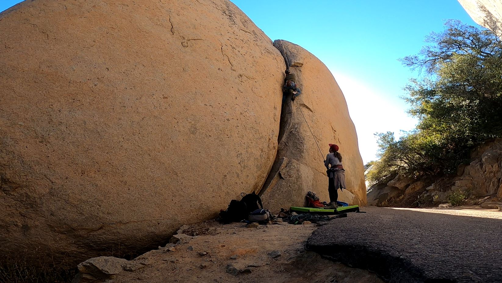
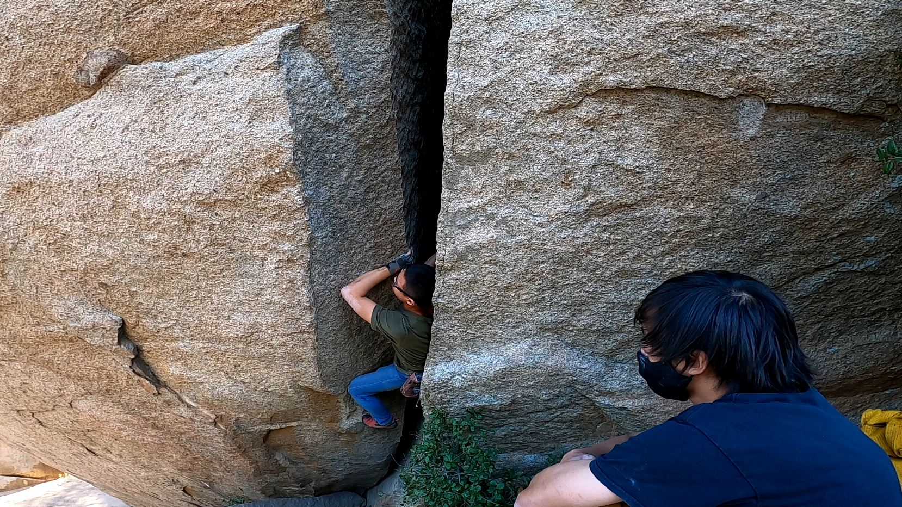
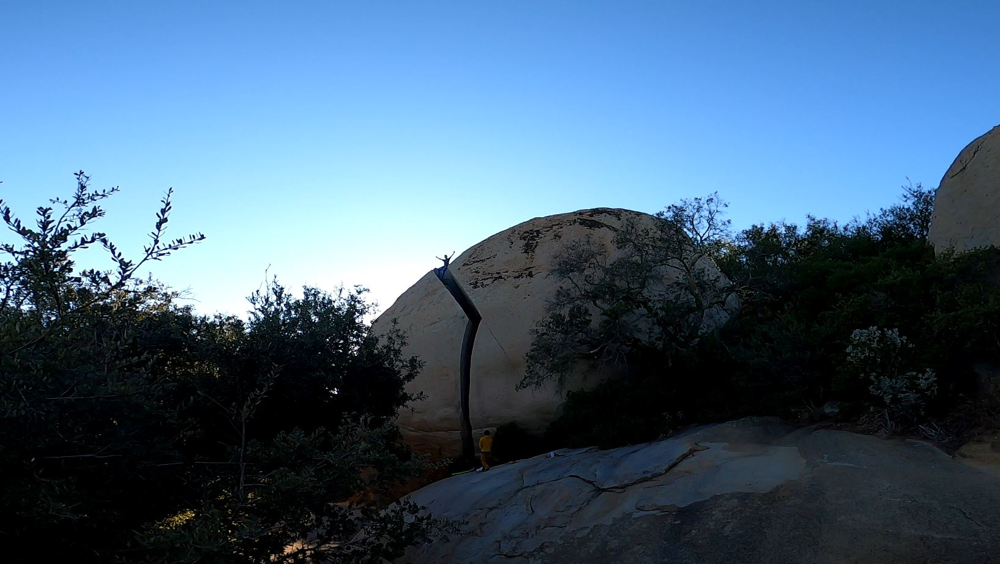
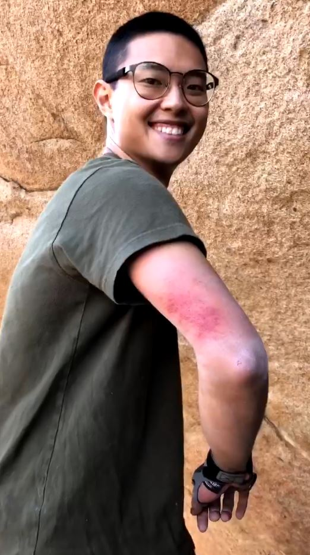
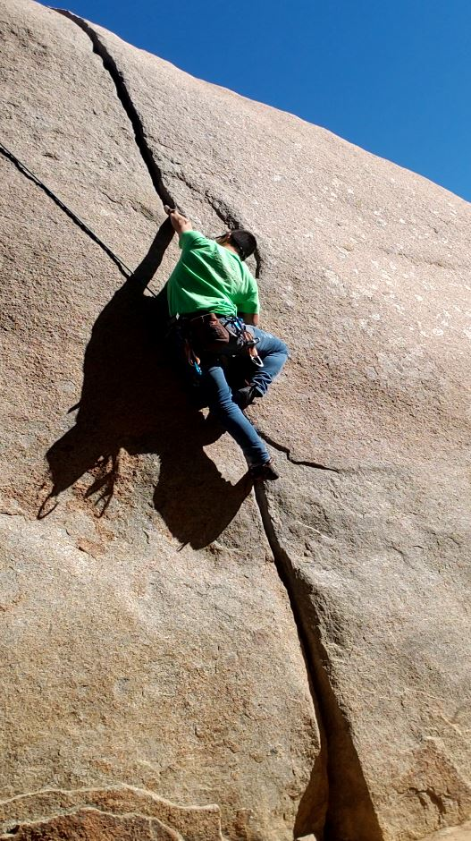

Day 1
-------

Yujia and I took a climbing trip down to San Diego (La Mesa area). The first day, we went to Mt. Woodson to do some crack climbing. We started the day on Elsa's Crack (T 5.7), a perfect hand crack. It was my first trad lead ever, though it was not very challenging. Next, we tried Poison Oak Crack (T 5.7). The placements were a bit more interesting and it also required some fist jams.

Matt and I then went on to solo Big Grunt (T 5.9+). This might be one of the most physically demanding climbs I've ever done. It starts with an overhanging offwidth which took all my energy just to stick in and was incredibly painful. 

After, the route transitions into a chimney before topping out on a slab. A fall on the slab section would make for some painful injuries, but luckily I made it through with ease. The view from the top was amazing, spanning from the mountains east of San Diego to the ocean.

The downclimb was a sketchy lower off some slopers to a stack of rocks. Definitely an ankle-breaker.

We finished the day with a solo on Baby Robbins (T 5.9). It was like a finger/hand crack love-child. I captured a pretty nice photo of Matt with the sunset on the climb.

Day 2
-------
Yujia and I got lost on our way to El Cajon wall. We spent the whole morning bushwhacking through landslide terrain, bushes, trees, and short boulders. It was awful. We made it to the base of the wall after about 2.5 hours, but the sun was too hot (80+ degrees F). We did the first pitch of Meteor (S 5.9), but bailed afterwards due to burning toes and low water supply. 

Day 3
-------
We headed back to Mt. Woodson to send Robbins Crack (TR 5.10a). You can climb it on lead, but I ended up setting up top rope instead. It had amazing hand jams and was difficult for me. It definitely shows I have much to learn about the basics of crack climbing. We also sent Elehant Crack (5.8) on our way out, but it was relatively unmemorable.

