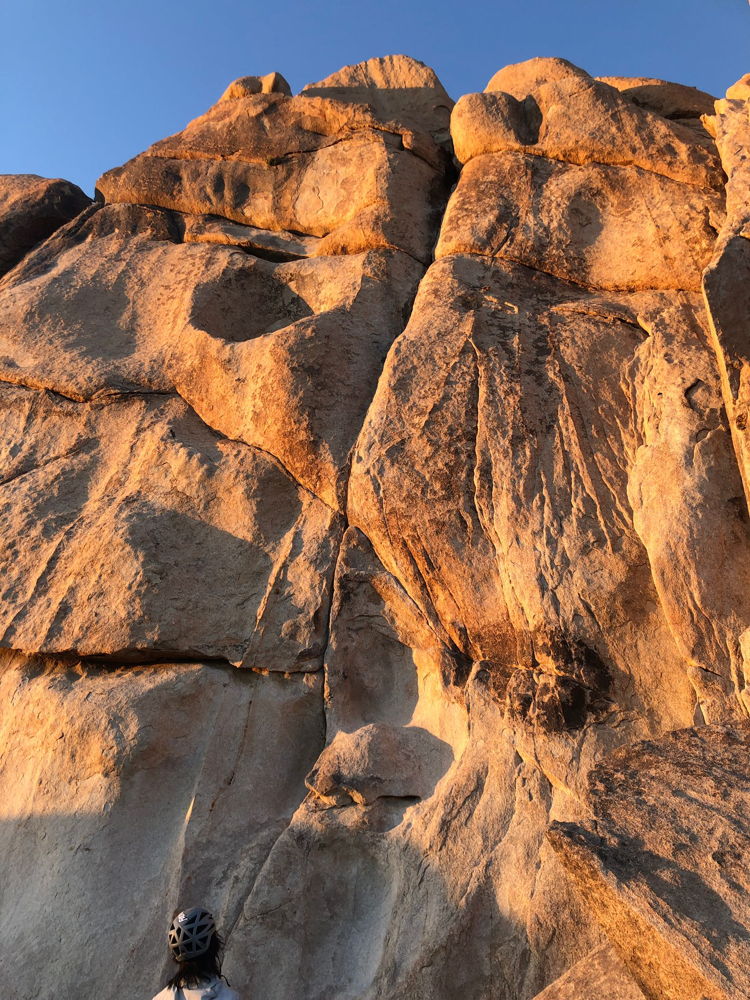
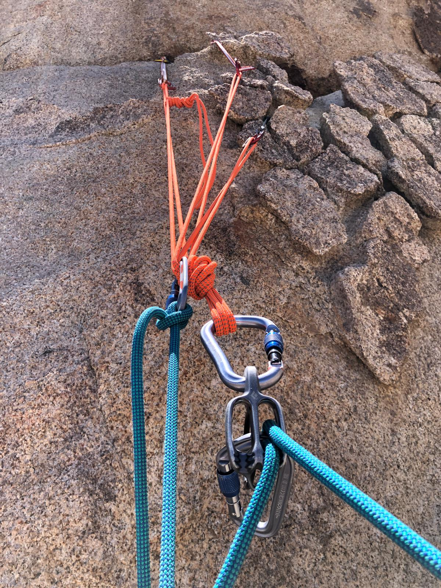
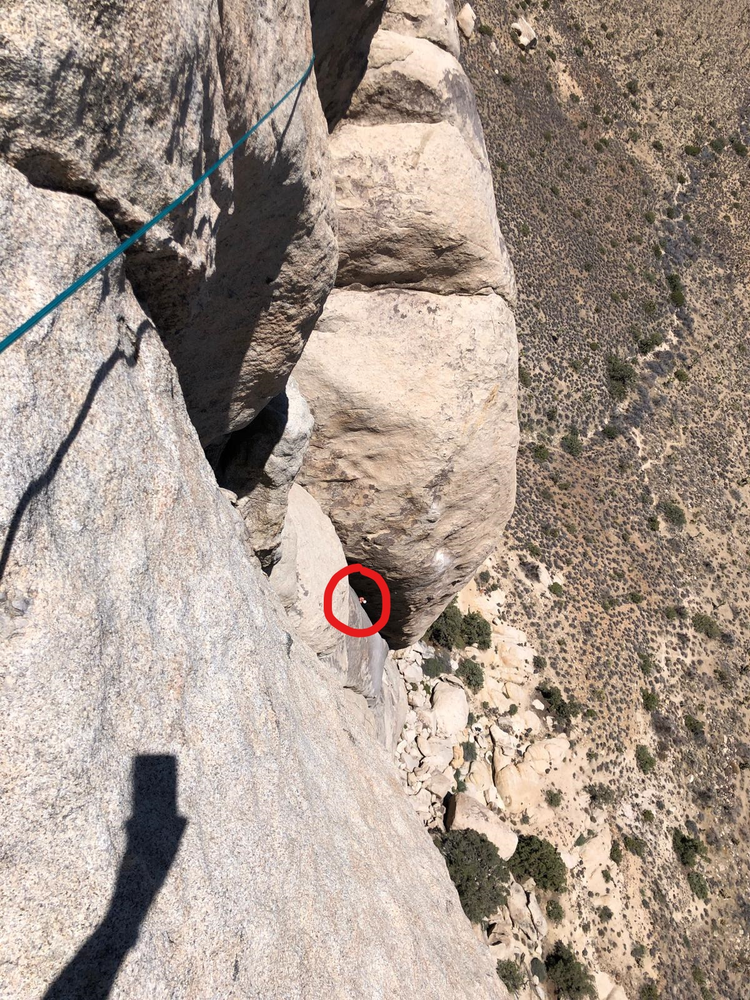
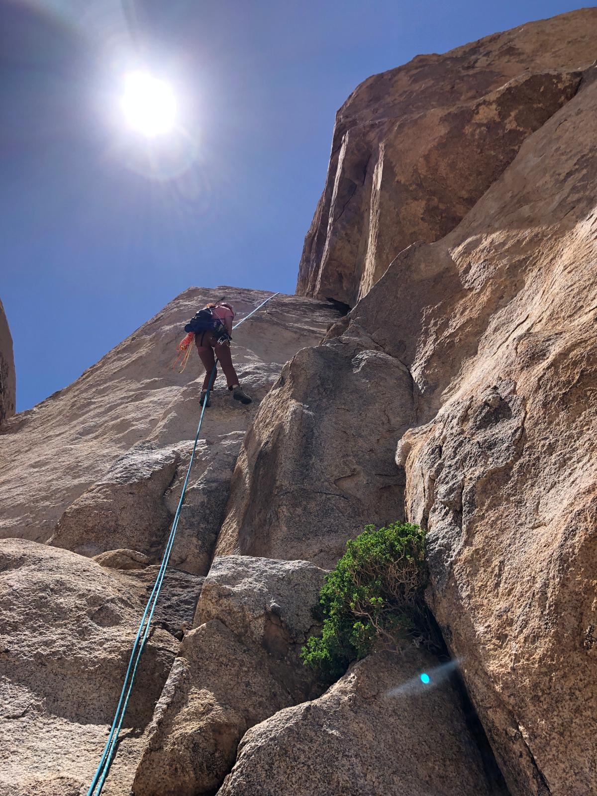
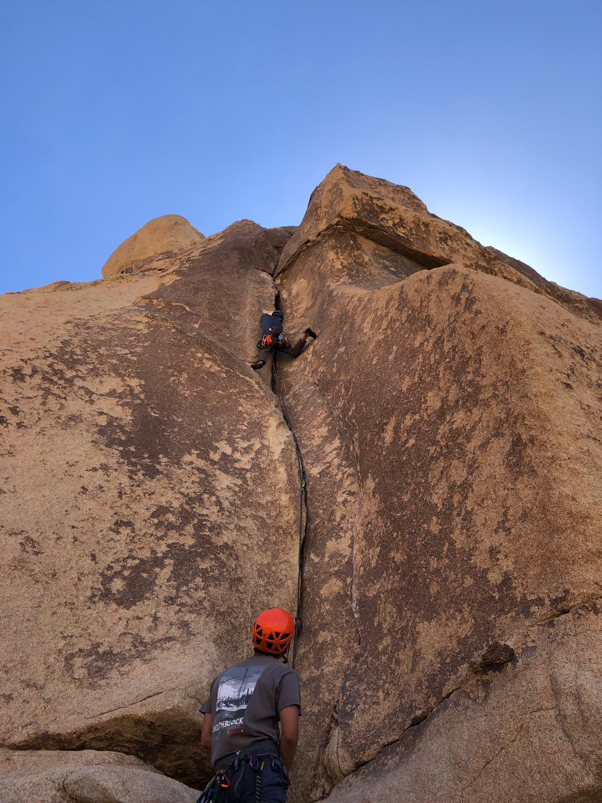

Day 1
-------

Getting to Joshua Tree was an absolute nightmare. We encountered at least 5 accidents along the way, all of which caused significant delays with bumper to bumper traffic. By the time we got to Joshua Tree, the sun was quickly setting, so we knew we would have to climb and move around efficiently. At first, we started hiking towards Breakfast of Champions, only to realize the approach would be roughly 40 minutes. We immediately scratched that plan and made our way over to Real Hidden Valley. We hopped on Sail Away (T 5.8-), which featured some superb crack climbing with easy protection.

After rappelling that route, we made our way over to Camp 30 at Hidden Valley to meet up with Matt. He was about to eat dinner, but we convinced him to ditch his food and come climb Double Cross (T 5.7) with us. Ironically, our camp site was at the base of the rock formation on which Double Cross is located, just around the corner from the start. The route started with some mildly spicy slab and transitions into a perfect hand and fist crack. I really enjoyed that the route forces you to use proper crack technique. There are hardly any placements for your feet besides the bomber foot jams. I was the first one up, meaning I climbed the route right at sunset. Yujia and Matt had to climb in the dark with their head lamps.

We came back to camp afterwards and enjoyed a meal that was far too luxurious to be a car camping experience. Spicy sausages, sauteed bok choi, and udon.

Day 2
-------

We woke up early the next day to quickly climb Right On (T 5.6 PG13, 4 pitches) before meeting up with Matt, Kai, and Cindy in the afternoon. Right On is on the same rock formation as Walk on the Wild Side (T 5.7, 2 pitches), however it ascends the north face. We had plans to link the first two pitches and the last two pitches together with our 70m rope. 

I ended up finishing the first pitch in two separate ways. At first, I followed a flake formation at the start which made for some difficult, 3D climbing. I realized that the rope drag would be too awful if I traversed to clip the first few bolts on the slab, so I lowered off some gear and reclimbed the slab section instead. I found the slab section to be particularly difficult for the grade, closer to 5.9 in my opinion. I climbed through the first set of anchors, through a perfect hand crack up to the second belay station just below the chimney pitch (third pitch).

The chimney was super easy, and contrary to comments online, it was very easy to protect using the inner-most crack. 

After finishing the chimney, I climbed up a gulley into some face climbing towards the top of the route. I realized that the last two pitches were exceptionally long, so it was looking more and more likely that I would run out of rope before the top. About 8 feet from the top of the route, I knew I was only a few feet from the end of my rope, so I decided to build a gear anchor instead of risking a short-rope and big fall.

After I had set up the anchor and put Yujia on belay, I looked down and saw Yujia climbing through the chimney. Luckily, since the guide-mode ATC is auto-locking, I had some time to quickly attach the break rope to my harness and take a picture. I like how small Yujia looks in comparison to the rock since it really gives scale to the size of the route.

Once she got up to the anchor, we climbed the last few feet. I mistakenly summited the peak only to realize that the rappel rings were not at the top. I had to downclimb a slabby finger crack with total exposure below, very scary! We climbed through the proper gully and down to some rappel rings on the back of the rock formation. After that, it was just a matter of hiking around the rock formation and back to the car.

Once we finished Right On, we met up with Matt, Kai, and Cindy at Echo Rocks / Echo Cove. They were looking for Hidden Wall, but unfortunately the wall was in the sun during the afternoon (contrary to the information in the guidebook). I mentioned that I wanted to try Tough and Go (T 5.9) at Echo Cove, so we made our way there and found it to be in the shade. I led the route and set up top rope for the others to try. I had to try pretty hard and found myself close to falling twice on the route. Definitely a proud send for me! This was my first gear anchor without slinging a tree or a chicken-head, so I was a bit freaked out about building the anchor. I literally placed 5 different pieces, slung a mediocre bush, and placed a bomber #3 as a backup for the master point (I couldn't get the #3 to be a part of the anchor since it was slightly below the master point).

I think Touch and Go might have been one of the best routes I've climbed. It was a perfect sampler of thin cracks and hand jams all the way up. The protection was good, and I found that proper crack technique made the route much smoother. I was going to post a picture of myself using jams to rest, but I liked this drop knee photo too much.

We finished up the day by heading back to the parking lot and downing an ice cold beer before heading home. A perfect finish to a perfect weekend.