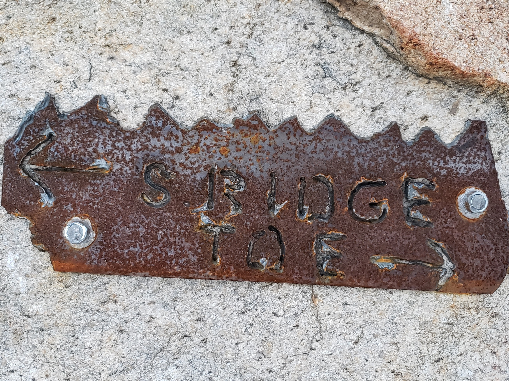

Weekend 1
=========

I spent two weekends in a row in San Diego with Yujia. The first weekend, Kate and Chen joined us at The Toe in El Cajon.

We climbed some easy single pitches as warm up, and then sent Shiver (T 5.7+). I paired with Chen and led both pitches. Kate and Yujia paired and took turns leading.

Weekend 2
=========

Kai and I decided to try our hand at speed climbing. There is a 1020 ft route called Sleeping Giant (T 5.10a). Most of the pitches are easier, but the final two are 5.10a. We decided to simul-climb the first 8 pitches, then normal belay the last two.

We worked out a system where we only have about 40 ft of rope between us, and the rope runs through our grigris allowing us to quickly adjust how much rope is between us. It also allowed us to quickly belay through tougher sections.

I don't think we moved particularly fast, but simul-climbing is naturally faster since we weren't stopping to set up many anchors. There were some decent pitches, lots of running along grassy ledges, and some close calls.

The final 2 pitches were awesome! I led pitch 9, which had the single hardest move in my opinion. The crux was short and led into a fun lieback and some interesting face climbing.

Kai led pitch 10, which was overall the most difficult pitch in my opinion. It had some sketchy slab at the start, a hard move into a crack system, and some straightforward but tough hand crack.

We went base-to-summit in 2 hours 47 minutes and 27 seconds. Pretty much a full hour longer than the previous record. Oh well... next time!

On our hike out, we ran into a large group of relatively older individuals. Turns out, two of them were the current speed record holders on Sleeping Giant! As one of them was describing how they set the record, I realized that they were the ones we based our simul-climbing system on! What a pleasant surprise, and what an honor to meet the people who develop and take care of such an amazing crag. The perfect end to a perfect day.