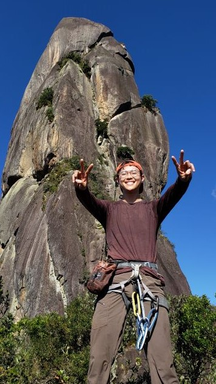
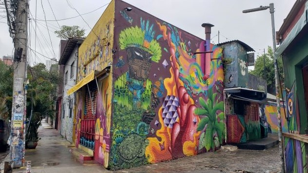

I'm too tired to recount the whole trip, so at some point in the future, I'll write a more detailed memoir. For now, here are some highlights expressed through photos.

Rio de Janeiro
--------------

Day 1
-------
Explored Ipanema and Leblon by foot. 

Day 2
--------
Climbed Pao de Acucar and Corcovado in a day with Igor! Finished by 2p!

Day 3
-------
Acai, dinner, and beers with Beatriz and Eduardo in Lagoa, Gavea, and Ipanema.

Day 4
-------
Boat trip! See featured photo.

Day 5
-------
Checked out cultural sites in Centro. Uneventful, except for an amazing dinner! My favorite meal in Brazil.

Day 6
------
Jeep tour through Tijuca Forest. Dinner at Joaquim's house in Jardim Botanico.

Day 7
------
Climbed Dedo de Deus near Tetropolis with Adilio.

Day 8
------
Cycled Vista Chinesa with Joaquim. 10% incline was killer.

Day 9
------
Worked on proofs at the airport on the way to Campo Grande.

Day 10
-------
Beatriz's wedding! The party afterwards was nuts!

Day 11
-------
Lunch in Campo Grande with Claire, Camilla, and Joaquim. Couldn't find a rapid test anywhere, so I had to stay the night in Sao Paulo at Camilla's

Day 12
--------
Walking tour of Sao Paulo historical district. Self tour of Beco do Batman.

Rapid test at a Drogosil and made it back to the US with a 2 hour delay in Chicago.