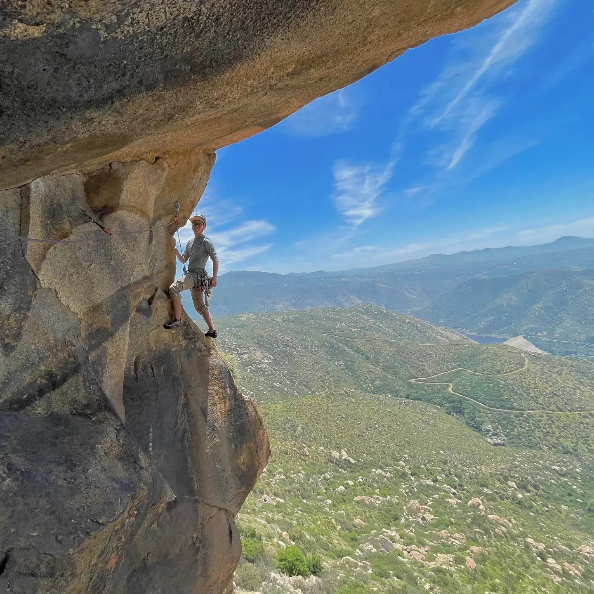

Yujia led her first trad route on The Bong (T 5.4) in Joshua Tree back in January! This was during a day trip to the park with Beatriz, who also made it to the bulge on The Bong on top rope! Yujia's second lead was on The Chief (T 5.5).

February was incredibly busy, and my dissertation proposal was in early March, so I didn't spend much time outdoors. I went on one trip with Kai to Joshua Tree. We climbed Colorado Crack and some other routes. Colorado Crack was pretty dang hard and scary for 5.9, but what an amazing experience nonetheless! 

In March, Yujia and I went back to Joshua Tree. We finally got to try White Lightning (T 5.7), along with some other routes like Trench Connection. We slept out in Sunfair Dry Lake in the car, and the weather was nice enough for a cozy night in the trunk. We also took the car off-roading to Pleasant Valley, which was an exciting experience turned slightly worrying when a thunderstorm rolled in mid-ride. You can bet we rushed out of there as fast as the bumpy road would let us. I definitely want to go back and hike Pleasant Valley. Something about that place is eerily alluring.

At the end of April, Matt and I met up at El Cajon in San Diego. The goal was to try Triton Tower (S 5.11a, 4 pitches) and set up top rope on Pockets of Resistance. Waking up in La Jolla, the temperature was in the 60s. This fooled us into thinking El Cajon would also be chilly. It was not. We set out on the 1.5 hour approach in 85 degree weather and baked in the sun all day. The tiny creek which is usually a trickle at most was now a rushing stream about 25 feet wide due to recent downpours. We spent 20 minutes finding a way across since the log bridge was completely submerged in water. 

Triton Tower was an incredible line. Pitch 2 is the roof pitch. Although it's only about 15 feet long, it was full of technical movement, slabby feet, and plenty of exposure. To be honest, I feel like Pitch 2 deserves a boulder grade more than it does a sport grade! I'd say somewhere around V2; felt about as hard as Monkey Bar Traverse in Red Rock. Refuge from the sun was also greatly appreciated. Matt led pitch 3, which starts off quite stout and eases off towards the end. I think it deserves its 5.11a grade. We finished up on the last pitch of Meteor, but decided to call it early since we were low on water and VERY hot. Some people on Mountain Project suggested traversing from the top of Triton Tower to the anchors of Pockets of Resistance to set up top rope. From where we were, this actually looked pretty dangerous, but perhaps we were looking at the wrong anchors?

Anyways, below is a photo dump of Spring 2023, in no particular order.

