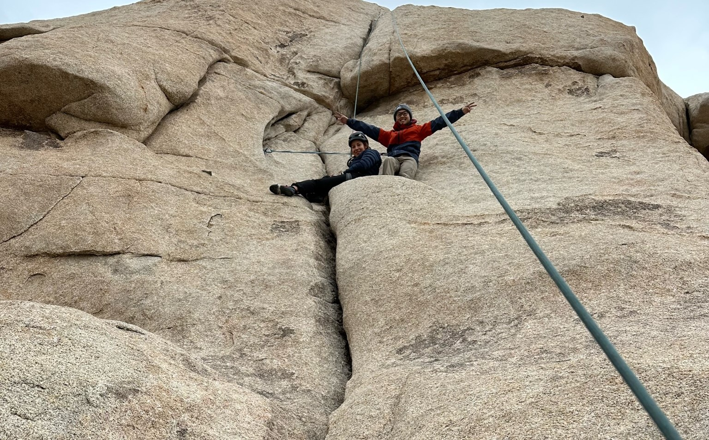
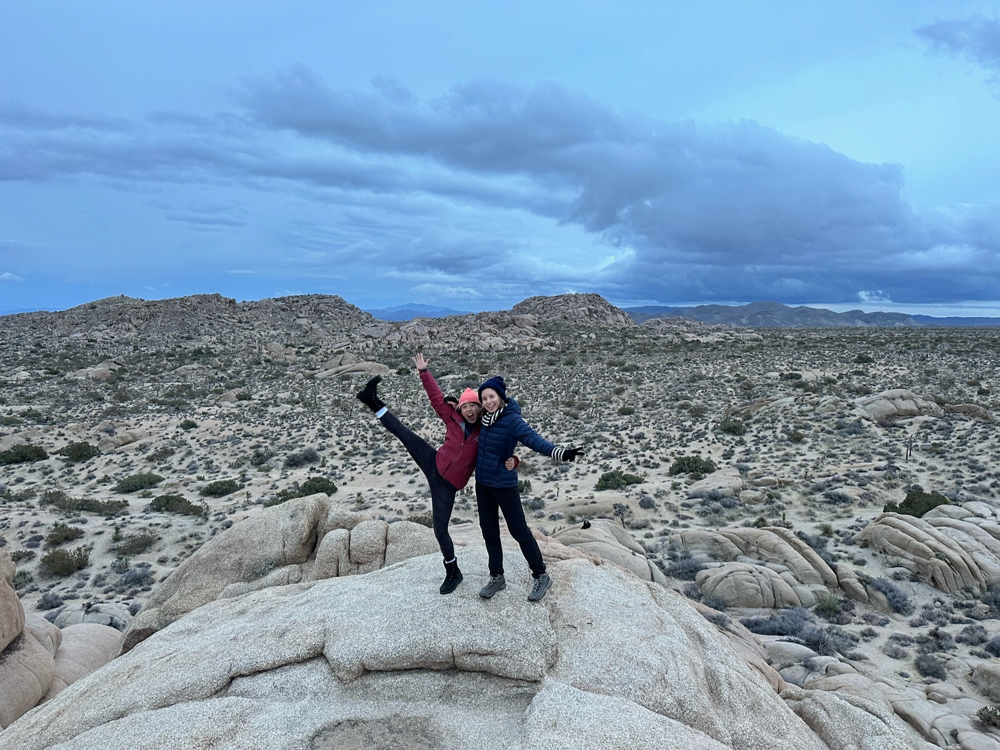
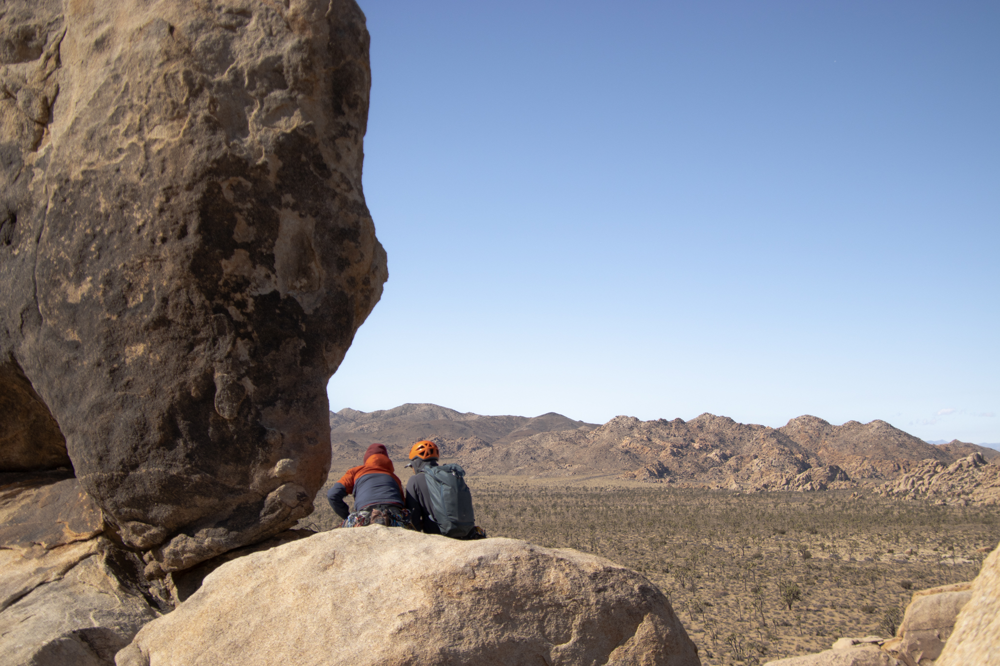

Yujia led her first trad route on The Bong (T 5.4) in Joshua Tree back in January! This was during a day trip to the park with Beatriz, who also made it to the bulge on The Bong on top rope! Yujia's second lead was on The Chief (T 5.5).

February was incredibly busy, and my dissertation proposal was in early March, so I didn't spend much time outdoors. I went on one trip with Kai to Joshua Tree. We climbed Colorado Crack and some other routes. Colorado Crack was pretty dang hard and scary for 5.9, but what an amazing experience nonetheless! 

In March, Yujia and I went back to Joshua Tree. We finally got to try White Lightning (T 5.7), along with some other routes like Trench Connection. We slept out in Sunfair Dry Lake in the car, and the weather was nice enough for a cozy night in the trunk. We also took the car off-roading to Pleasant Valley, which was an exciting experience turned slightly worrying when a thunderstorm rolled in mid-ride. You can bet we rushed out of there as fast as the bumpy road would let us. I definitely want to go back and hike Pleasant Valley. Something about that place is eerily alluring.

Anyways, below is a photo dump of Spring 2023, in no particular order.

