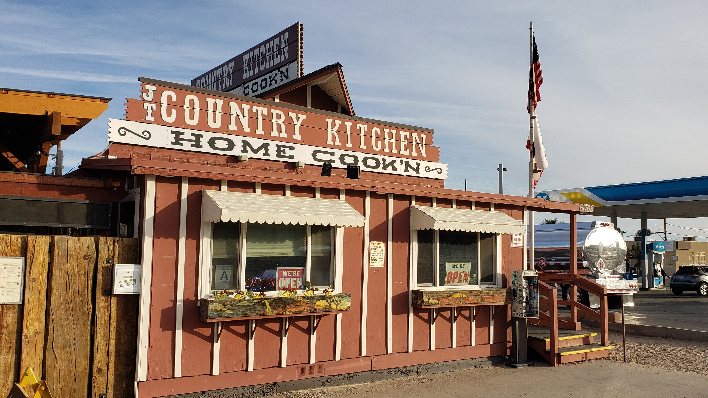
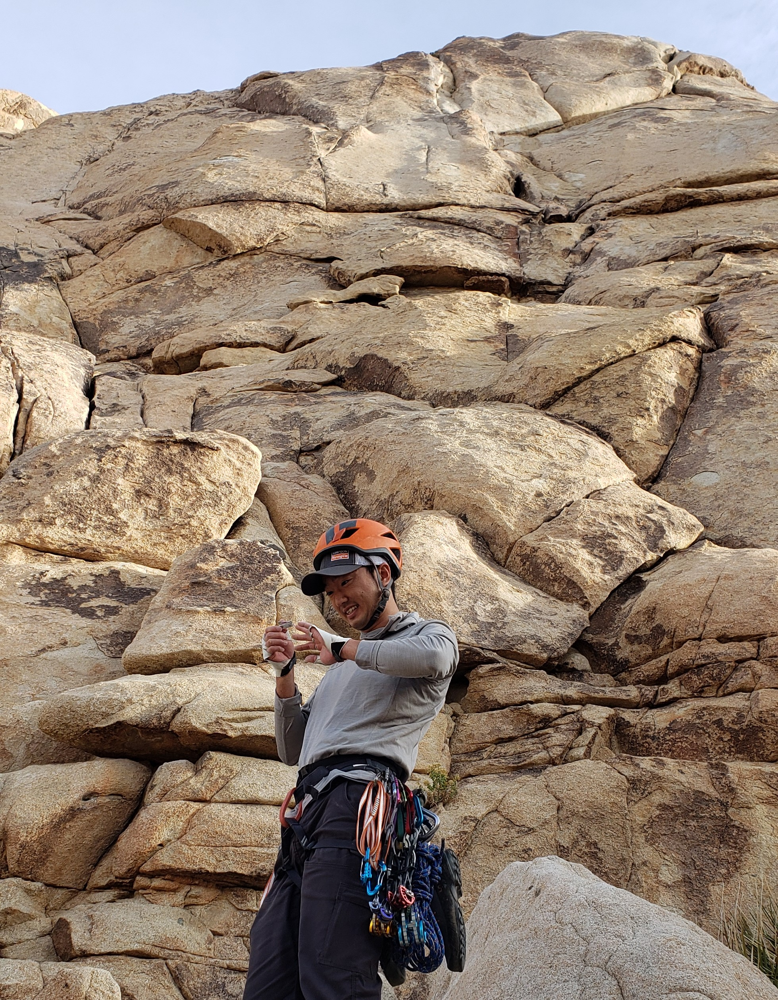
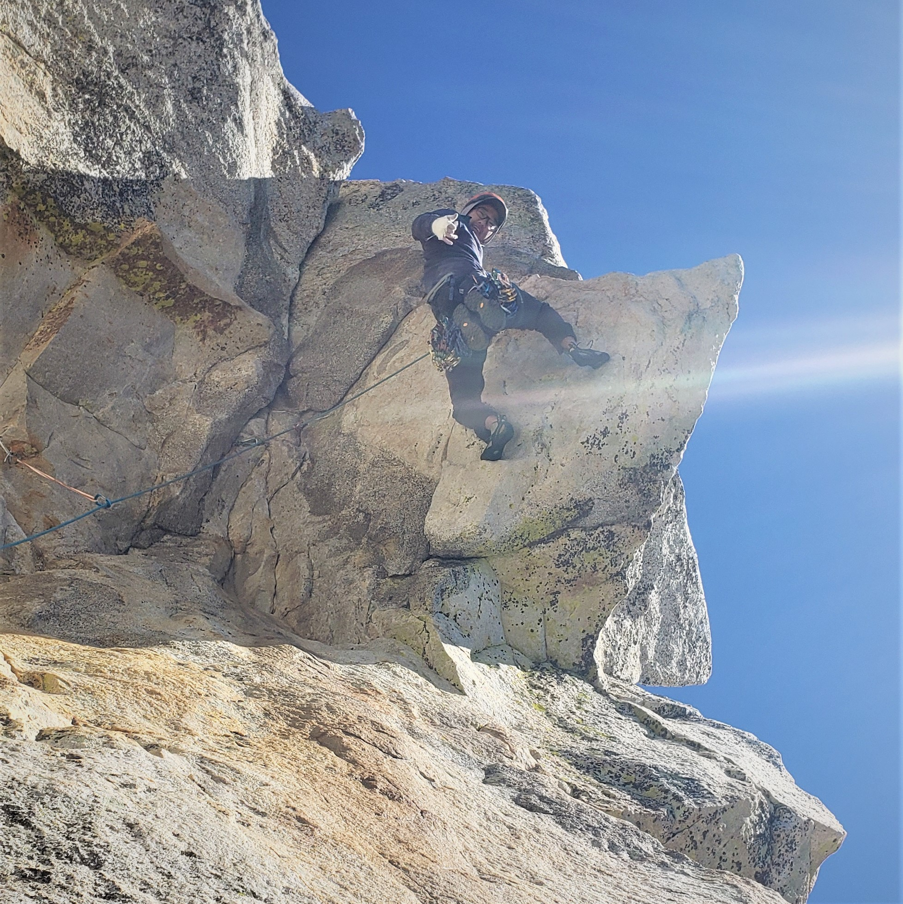
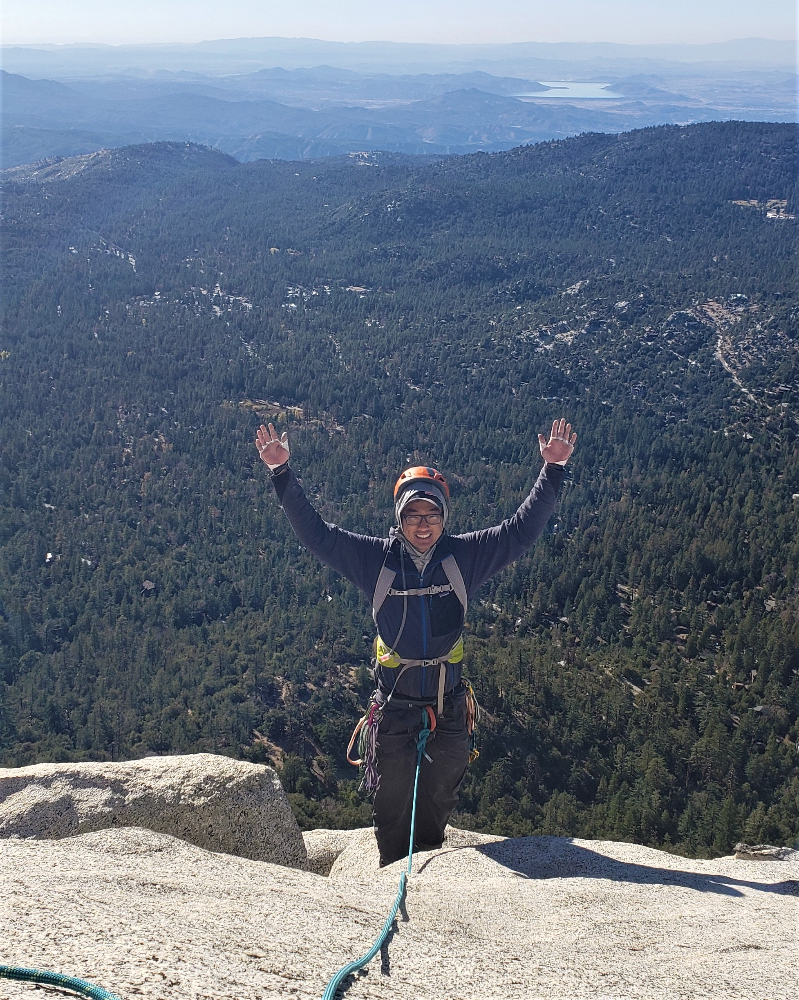

In preparation for bigger days, Kai and I decided to spend a weekend climbing as much as possible. Our trip would unfold in two stages, first in Joshua Tree, second in Tahquitz. The goal was to do as much climbing as possible in Joshua Tree, then climb a longer route in Tahquitz.

Day 1
=====

We woke up pretty early and grabbed some breakfast before headed over to Lost Horse Wall. 

We climbed Dappled Mare (T 5.8) relatively quickly, treating it as a warm up for the day. I got to lead pitch 2, which had an interesting downclimbing traverse leading into a nice hand crack dihedral.

After Dappled Mare, Kai and I quickly knocked out The Swift (T 5.7). It ascends a crack next to Dappled Mare, and the first pitch went by pretty quickly. On the second pitch, I accidentally drifted onto the last few feet of Bird on a Wire (T 5.10a). The moves were interesting, almost like a mixture of face climbing, stemming, and crack all at once.

Kai and I left Lost Horse Wall, swallowing a banh mi in the parking lot. We headed over to Right On (T 5.6) for our final route of the day. Kai led the first heady pitch, which has a very scary runout on slippery slab. Actually... he lead both pitches! We had to stop just short of the summit again since our 70m rope was about 15ft too short.

We rappelled with the sun still shining, scrambled out during sundown, and walked back to our car in the dark. We had to park about a mile or two away since the closest parking lot was full. Apparently, Eddie drove right by us with Dorene's friends. He said he recognized us, but there's no way we could've known since headlights in pitch black shine blindingly bright.

Day 2
=====

Kai and I camped in some park at Idyllwild. It was freezing this time of year. We got to the base of Tahquitz pretty early in the morning. Our goal was to link Coffin Nail (T 5.8) into Traitor Horn (T 5.8).

I had heard that Coffin Nail had quite a bit of exposure, so guide books warn that it's not for the faint of heart. I didn't think too much of the warning when I first saw it, but boy they weren't joking.

Kai led the first pitch, nothing special, mostly scrambling. I got to lead the second pitch, which some deem the money pitch. I saw my life flash before my eyes on that pitch. It starts off with a fairly strenuous, and not easily protectable chimney. At some point in this chimney, I punctured my knee. I didn't realize it was bleeding until I had gotten through the chimney and the adrenaline wore off.

After the chimney came a fully exposed, diagonal hand/fist crack. It took me about 5 minutes just to start the crack because I was too scared to start it. The exposure was enormous! The entirety of Idyllwild forest spanned below me, meancingly watching from the corner of my periphery. I was so terrified while climbing, I repeatedly chose to knee jam even though my right knee was bleeding profusely by this point. I could feel the blood running down my leg, my pants growing mushy, and my socks getting wet. What a damn experience.

The diagonal crack ends with a rest, with a challenging lieback still to come. At the top of the lieback is the crux of the pitch: a small roof with a finger crack pull through. I got to the crux pumped, placed a .3 (my last piece) as quickly as possible, didn't have the energy to test it. I knew if I hung around, I would fall anyways, so I jammed my fingers above the crux and pulled as hard as I could.

I managed to pull through the crux, only to be faced with another 20 or so feet of hand crack. Luckily, I could rest in that position, so I took the hand crack slowly and methodically. The rope drag was horrendous. Finally, I made it to the top of pitch 2, my knees shaking (and bleeding) and my mental shattered.

Kai traversed over (pitch 3) to the fourth pitch, which transitions from Coffin Nail to Traitor Horn. Though the route is called Traitor Horn, we actually climb through True Horn... Traitor Horn is a different rock feature that we pass by during the traverse. This pitch wasn't easy, and even following, it felt heady. You climb up to the horn, and then do some overhanging face climbing to get over the horn. You have to stand up on the thin, slanted horn, and then work your way up... all with hardly any protection. Again, the exposure underneath the horn was full. If you slip, it will feel like you're about to fall 300 to 400 feet. You'll actually fall about 30 feet, since the last piece was at the base of the horn... unless you count the bomber #1 that Kai placed near the tip of the horn... I doubt it would've held.

I led the final pitch, which included some insane runouts. The climbing wasn't hard... mostly slab. But at some points, I had about 25 feet since my last piece. Not a very comfortable pitch.

All in all, Kai and I had a blast. We were pretty tired from all the climbing and mentally broken by Tahquitz. Are we going to try another Sufferfest Lite again? You bet.

