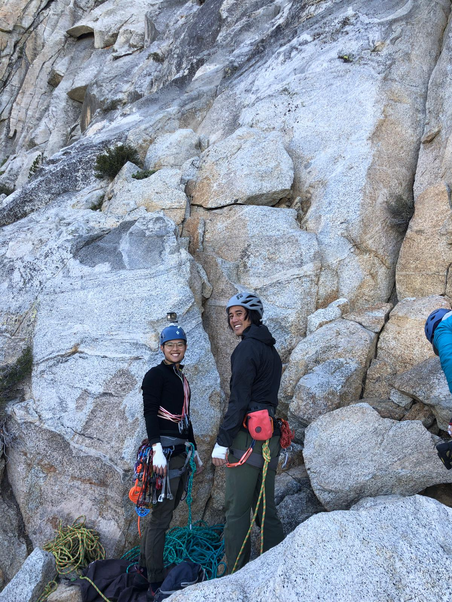

Flying high off the back of Walk on the Wild Side in Joshua Tree, Yujia, Matt, and I teamed up again to tackle another multi-pitch trad route. This time, we decided to cut our teeth at Tahquitz, the birthplace of the Yosemite Decimal System (YDS).

I had been wanting to go to Tahquitz since I first started climbing. I heard so many stories about legendary climbers like Royal Robbins, John Long, and Lynn Hill training at Tahquitz. The goal for this trip was to get used to building gear anchors on an easy route. We decided to climb The Trough (T 5.4, 4 pitches, approx. 400ft), which was the first route up Tahquitz (FA: J. Smith, B. Brinton, and Z. Jasitas, 1936). In fact, in the old school YDS, this route was used to define 5.0.

We were one of the first parties to make it to the base of the wall, but we were definitely the slowest party on The Trough. We started up first, but were passed by 3 other parties before reaching the summit. It's definietly slow taking 3 people up the wall, but I had no problem with our speed since safety was the first priority. I took an unreasonably long time building the gear anchors, and Matt had to constantly untangle my new 70m rope.

While we were chatting on Pine Tree Ledge, I remember telling Matt that this was the first time I was intimitated by the size of the wall while pulling up to the parking lot. From afar, Tahquitz truly is a magnificent hunk of rock. However, this was also the first time that the route looked less imtimidating the close we got. The climbing turned out to be a breeze, but rope management and anchor building proved to be the true bottlenecks. At the end of the day, it was a bit of an underwhelming climb, but I'm glad I learned these trad techniques on an easy route!

P.S. We saw a helicopter rescue on the wall not too far from us, a reminder to be safe!