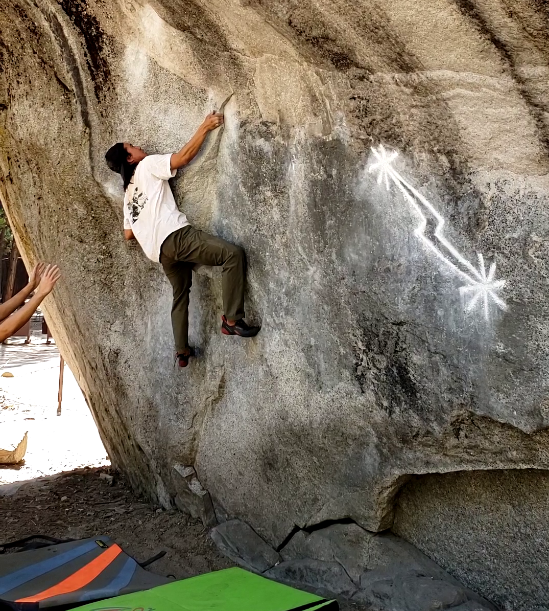
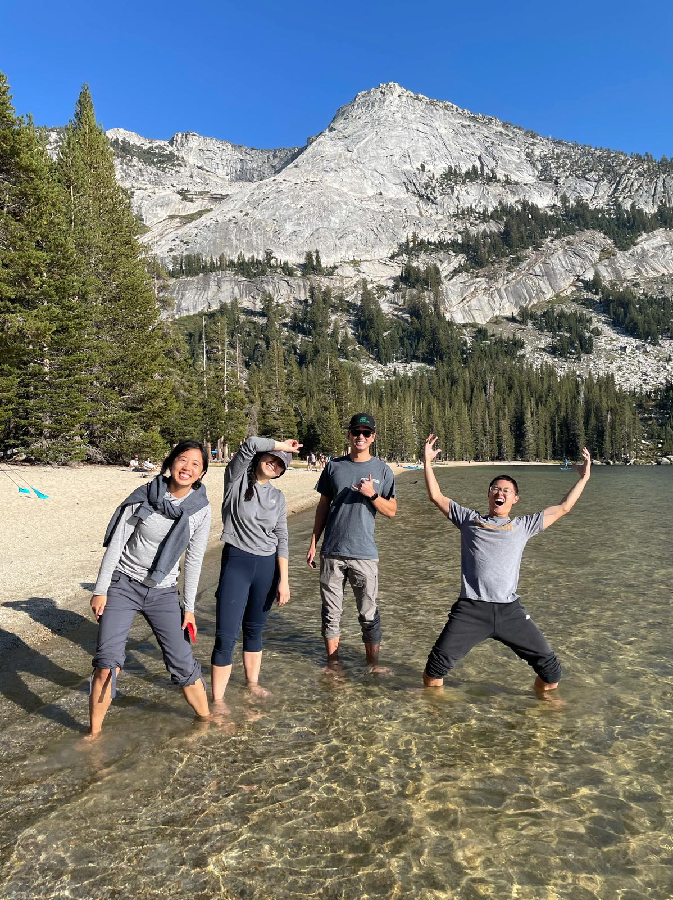

Day 1
=====

Before meeting up with the rest of the group, Yujia and I decided to climb West Country on Stately Pleasure Dome. It has a fantastic view of Tenaya Lake, and you literally park at the base of the climb. The climbing was interesting and varies, with varied face and crack on pitch 1, thin liebacking on pitch 2, and varied climbing and traversing on pitch 3. The descent was a nice friction walk down, though Yujia opted to rappel.

Day 2
=====

On the second day, it was too hot to climb in the Valley, so we decided to climb at some crag in Tuolumne (I forgot the name). Nothing special that day, mostly friends trying out trad lead for the first time. Yujia and I hopped on some multipitch. The summit had a decent view. All in all, a pretty chill day.

Day 3
=====

On the third day, the group decided to go bouldering in Yosemite Valley. We tried Midnight Lightning, Bachar Crack, and a few other classics. Didn't send anything hard, but we did manage to send a few casual boulders. Don't remember their names.

After bouldering, we stopped by Tenaya Lake on our way out of the park. The water was ice cold, but I still dunked my whole body for a much-needed wash!

