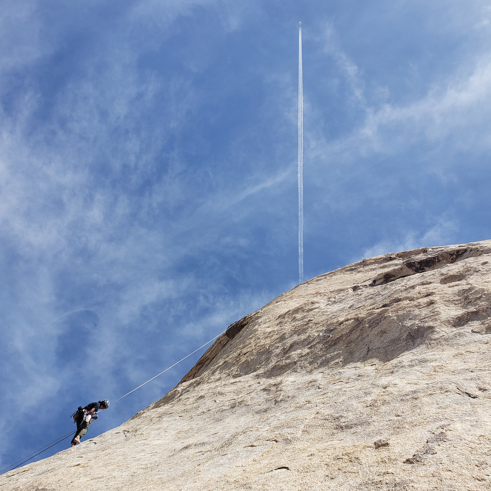

Day 1
--------
Yujia, Matt, Eddie, and I teamed up for a quick trip to Joshua Tree. The goal was to do some bouldering on the first night, for Yujia and Eddie to boulder on day two, and for Matt and I to do two multi-pitches on day 2.

We pulled into Hidden Valley Campground hoping to simply get a night session in, but as we approached Stem Gem, the guy who was originally camping there moved one spot over. He offered us his original camp sight, which definitely made the trip ten times better! I tried Stem Gem (V4) and made some progress compared to last year. Matt re-sent it.

After Stem Gem, we headed to Chuckawalla boulder. Everyone tried Flintlock Dyno (V0), though only Yujia was unable to send it. She got really close though! Her fingertips were right on the last hold. Then Matt and I sent Chuckawalla (V1), Chuckawalla Roast (V1+), and Medium Chucky (V4). Given the vague description of the start, we accidentally skipped the first move on Medium Chucky, but I highly doubt this would have made a difference. I think Little and Medium Chucky both deserve a downgrade to V3, and Chuckawalla Roast deserves an upgrade to V2. Both Matt and I thought Chuckawalla Roast required some tough pulling on crimps, much harder than V1+, whereas the sit start to Little and Medium Chucky added little difficulty. Yujia and Eddie also sent Big Lizard in My Backyard (VB).

On our way back to the campsite, we stopped by False Hueco boulder. Matt and I sent False Hueco (V1), which has an incredible move off a heel and a perfect, no-hands knee bar. What a fantastic problem! Eddie bet me $500 that I couldn't flash Torquemeister (V4). I made him sweat when I made it through at least half of the moves. It felt doable, though I didn't quite have the right read on the last two moves the first time I tried it. Oh well.

Day 2
-------
Day 2, Matt and I awoke at sunrise. We packed up our stuff and left for Walk on the Wild Side (T 5.8, 3 pitches). We got to the wall, and accidentally started up Us and Them (T 5.9, 2 pitches) instead. The route is entirely slab climbing, and it's also extremely run out... The first bolt was probably 25 feet off the ground with an insecure clipping position and a bad landing. The upper bolts had roughly 15-20 feet of spacing between them, which could lead to a 30-50 foot fall onto a horizontal ledge below. To prove my point, I later saw some comments about people slipping and breaking their ankles from these run outs. Definitely deserves an R rating or needs more bolting. I think old school climbers want people to accept the risks that come with climbing, and realistically, I can understand why they didn't protect some of the easier climbing sections. That being said, holds can break and people can make mistakes. The consequences for these unfortunate events seem a bit too dire for the non-lifers like us. Maybe that's their way of telling us gumbies to stay off their routes.

The second pitch was noticeably easier, but the runouts were getting ridiculous. At one point, I think I had 25-30 feet between me and my last clip. The moves were easy, but insecure given that they were all slab moves on sloper crimps. At some point, survival mode kicked in and shut out the danger behind me, allowing me to focus completely on my movement. It was a nice feeling, but definitely not worth the risk. 

The most redeeming factor for Walk on the Wild Side is the ledge at the top of the climb. It is shaped like a reclining sofa, and it overlooks a huge land. On the horizon, you can see mountains with snow. Meanwhile, the hot sun is beating down on us as we lay down on the cold rock. Oddly enough, it's almost feels like going to the beach on a summer day. 