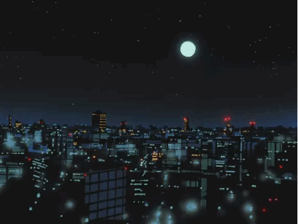
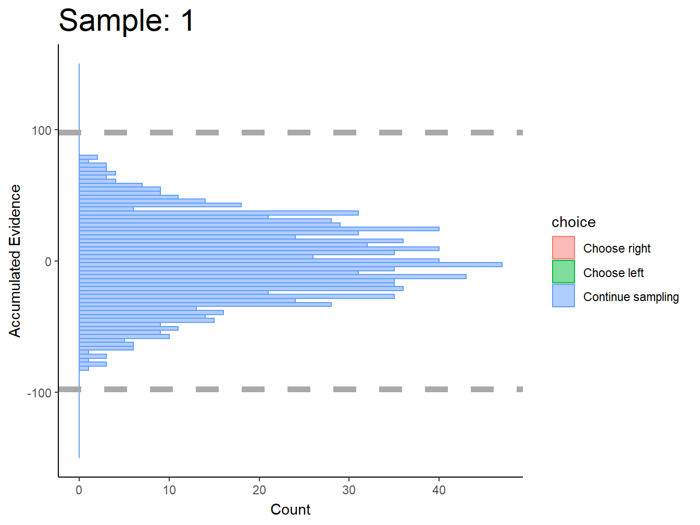
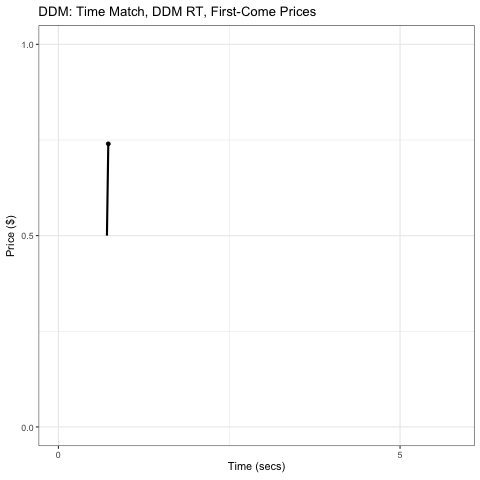

Brenden Eum (2024-11-19)

Aruarian Dance Remix
<audio controls>
  <source src="aruarian_dance_remix.mp3" type="audio/mpeg">
</audio>

This is a compilation of reports that I write out of curiosity. A place to put results that I find interesting, but that I don't feel the need to turn into a rigorous study. My data will usually come from my own studies or publicly available data. If you're looking for code, data, or manuscripts for my papers, you can usually find them on [my website](brendeneum.com).

Sometimes when I have time I like to make music. The music on this home page is my own. I'll swap the song occasionally.

Feel free to shoot me an email if you have any questions or if you just want to chat (b.eum@rotman.utoronto.edu)!

<ul> <!-- This starts an unordered list. -->
    <li> <!-- List element -->
        <a href="https://latenightbayes.com/" target="_blank">Late Night Bayes (prior to Dec 2024)</a>
        

            
        

    </li>
    <li>
        <a href="https://latenightbayes-python-test.netlify.app" target="_blank">Python Test Page</a>
        

            
        

    </li>
</ul>

Midsummer Madness Cover
<audio controls>
  <source src="midsummer_madness.mp3" type="audio/mpeg">
</audio>

Shinjuku Station
<audio controls>
  <source src="shinjuku_station.mp3" type="audio/mpeg">
</audio>

Fresh Static Snow Cover
<audio controls>
  <source src="fresh_static_snow.mp3" type="audio/mpeg">
</audio>

Energetic
<audio controls>
  <source src="energetic.mp3" type="audio/mpeg">
</audio>

Sonar
<audio controls>
  <source src="sonar.mp3" type="audio/mpeg">
</audio>

Take Five Cover
<audio controls>
  <source src="take_five.mp3" type="audio/mpeg">
</audio>

Hummed Low Cover
<audio controls>
  <source src="hummed_low.mp3" type="audio/mpeg">
</audio>

Minimalistic Deep
<audio controls>
  <source src="minimalistic_deep.mp3" type="audio/mpeg">
</audio>

Bad Bad News Cover
<audio controls>
  <source src="bad_bad_news_short.mp3" type="audio/mpeg">
</audio>

Funky D Minor
<audio controls>
  <source src="funky_d_minor.wav" type="audio/wav">
</audio>