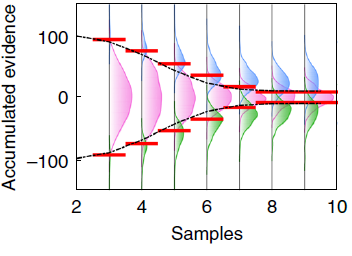
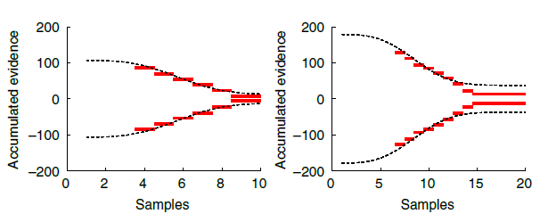

# Introduction

This notebook is a test of the methods from Glickman, Moran, and Usher (2022, Nat Hum Behav). I would like to see if their algorithm that dynamically estimates collapsing bounds (Decision Classification Boundary, DCB) works with perceptual data from an upcoming belief tracking project and value-based data from Eum, Dolbier, and Rangel (2022).

### Simulated, perceptual data {-}

First, I will simulate data for two cyborgs using a DDM. Their task will be to select from two streams of rectangles whichever stream has the taller average height (see Tsetsos et al. 2016 PNAS or Glickman et al. 2022 Nat Hum Behav). The first cyborg will utilize fixed decision boundaries; the second cyborg will utilize collapsing boundaries (Weibull function, per tradition). I will test if the DCB algorithm can recover the decision boundaries for both cyborgs.

### Real, perceptual data {-}

Second, I will use preliminary data collected for my upcoming slider task. The task is again for subjects to select from two streams of rectangles whicheer stream has the taller average height. I think it would be interesting to see if DCB works with both (1) accumulated evidence and (2) location of the slider.

### Real, value-based data {-}

Third, I will read in the data from Eum, Dolbier, and Rangel (2022). I will only use trials from the visible condition. This will be interesting since there isn't a stream of varying evidence. It's just a single value comparison that accumulates over time. If we use an aDDM, then there will be some variation in evidence over time based on fixation data. 

### Here's a quick summary of what DCB does: {-}

1. Discretize your time-dimension.
2. Consider a single trial. At any time during that trial, the sequence of stimuli has provided a stream of evidence in favor of one of the actions. In the case of perceptual tasks, we can take the sum of evidence over time and come up with a metric for "accumulated evidence" at any given time point. This might be a bit trickier in value-based decision tasks.
3. At any given point in time, agents have three potential actions (continue sampling, choose left, choose right). If we consider one point in time, then we can look at the distributions of actions along a single dimension, accumulated evidence. 
3. Each trial yields one point along this accumulated evidence dimension. The points are labeled by the action taken at that time during that trial. This allows for supervised separation by linear discriminant analysis (LDA).
4. The boundary separation curves approximate decision boundaries over time.

<center>

</center>

```{r, message=FALSE, include=FALSE}
rm(list = ls())
seed = 1337
library(dplyr)
library(ggplot2)
library(gganimate)
library(hrbrthemes)
library(svMisc) #progress tracker
library(truncnorm)
library(MASS) #LDA
```


# Simulated, perceptual data

## Simulate data {.tabset}

The task is to select from two streams of rectangles the stream with the taller average height. We will generate two DDM cyborgs, the first with fixed decision bounds, the second with collapsing decision bounds.

### DDM function {-}

Simulate behavior for a single trial using a DDM with symmetric bounds about 0.\
*Input*: Two equal-length streams of evidence, DDM parameters.\
*Output*: A time-series of choice (0=R, 1=L, 2=continue) and accumulated evidence (scaled by drift since we are working with the DDM).

```{r}
DDM <- function(L=c(0,0,0), R=c(0,0,0), b=0, d=.002, sig=.03, bound=c(1,1,1)) {
  if (length(L)!=length(R)) {stop("L and R differ in length.")}
  if (length(b)!=1 | length(d)!=1 | length(sig)!=1) {stop("Invalid DDM parameters.")}
  if (length(bound)!=length(L) & length(bound)!=1) {stop("Invalid bound. Must be defined at every time point or fixed.")}
  if (length(bound)==1) {ub <- rep(bound, length(L))} else {ub <- bound}
  df <- data.frame(
    sample = rep(NA, length(L)),
    choice = rep(NA, length(L)),
    ae = rep(NA, length(L))
  )
  RDV <- b
  accumEvid <- 0
  boundaryHit <- F
  for (t in 1:length(L)) {
    df$sample[t] <- t
    RDV <- RDV + d*(L[t]-R[t]) + rnorm(1, mean=0, sd=sig)
    accumEvid <- accumEvid + d*(L[t]-R[t]) # Accumulated evidence depends on the model you're using.
    df$ae[t] <- accumEvid
    df$choice[t] <- 2
    if (RDV>=ub[t] | RDV<=-ub[t]) {
      if (RDV>=ub[t]) {df$choice[t] <- 1}
      if (RDV<=-ub[t]) {df$choice[t] <- 0}
      boundaryHit <- T
      break
    }
  }
  # if (boundaryHit==F) { #Use this to figure out which trials didn't reach a decision.
  #   print("Decision was not reached within allotted number of samples.")
  # } 
  return(df)
}
```

### Trial Data {-}

This will be exactly the same for both the fixed an collapsing cyborgs. Heights will vary around 50, bounded within (0,100). All trials will favor either L or R, but the degree of difficulty may vary.

```{r}
set.seed(seed)
nSamples = 50
nTrials = 1000
byTrial.mean = 50
byTrial.sd = 20
bySample.sd = 20
lb <- 0
ub <- 100

simulateData <- function(nSamples,nTrials,byTrial.mean,byTrial.sd,bySample.sd,lb,ub) {
  simData <- data.frame(
    trial = 1,
    L = rtruncnorm(
      nSamples,
      mean = rnorm(1, mean = byTrial.mean, sd = byTrial.sd),
      sd = bySample.sd,
      a = lb,
      b = ub
    ),
    R = rtruncnorm(
      nSamples,
      mean = rnorm(1, mean = byTrial.mean, sd = byTrial.sd),
      sd = bySample.sd,
      a = lb,
      b = ub
    )
  )
  
  for (n in 2:nTrials) {
  #progress(n, nTrials) #progress tracker
  tempData <- data.frame(
    trial = n,
    L = rtruncnorm(
      nSamples,
      mean = rnorm(1, mean = byTrial.mean, sd = byTrial.sd),
      sd = bySample.sd,
      a = lb,
      b = ub
    ),
    R = rtruncnorm(
      nSamples,
      mean = rnorm(1, mean = byTrial.mean, sd = byTrial.sd),
      sd = bySample.sd,
      a = lb,
      b = ub
    )
  )
  simData <- rbind(simData, tempData)
  }
  return(simData)
}

simData <- simulateData(
  nSamples,
  nTrials,
  byTrial.mean,
  byTrial.sd,
  bySample.sd,
  lb,
  ub)
```


### Fixed bounds cyborg {-}

Bounds are fixed to 50 and -50 via the 'bound' attribute of the fixedCyborg.ddm object.

```{r}
set.seed(seed)

fixedCyborg.ddm <- list(
  b = 0,
  d = .9,
  sig = 4,
  bound = 50
)

trialData <- list(
    L = simData$L[simData$trial==1],
    R = simData$R[simData$trial==1]
  )  
fixedCyborg.data <- do.call(DDM, c(trialData,fixedCyborg.ddm))
fixedCyborg.data$trial <- 1

for (trial in 2:nTrials) {
  #progress(trial,nTrials) #progress tracker
  trialData <- list(
    L = simData$L[simData$trial==trial],
    R = simData$R[simData$trial==trial]
  )  
  tempData <- do.call(DDM, c(trialData,fixedCyborg.ddm))
  tempData$trial <- trial
  fixedCyborg.data <- rbind(fixedCyborg.data, tempData)
}
fixedCyborg.data <- na.omit(fixedCyborg.data)
summary(fixedCyborg.data)
```

### Collapsing bounds cyborg {-}

Bounds are decreasing as a Weibull function. Weibull parameters are taken directly from Glickman et al. (2022), which I'm led to believe are taken directly from Hawkins et al. (2015). The Weibull function is taken directly from Hawkins et al. (2015). The scale parameter ($\lambda$) is fixed to 4. Shape ($\kappa$) and asymptotic convergence ($a'$) can vary.

```{r}
set.seed(seed)

weibullbound <- function(t, a, k, lam, ap) {
  return( a-(1-exp(-(t/k)^k))*(.5*a+ap) )
}

collapsingCyborg.ddm <- list(
  b = 0,
  d = .9,
  sig = 4,
  bound = weibullbound(t=c(1:nSamples), a=100, k=3, lam=4, ap=10) # see Glickman et al. (2022) or Hawkins et al. (2015)
)

trialData <- list(
  L = simData$L[simData$trial==1],
  R = simData$R[simData$trial==1]
)  
collapsingCyborg.data <- do.call(DDM, c(trialData,collapsingCyborg.ddm))
collapsingCyborg.data$trial <- 1

for (trial in 2:nTrials) {
  #progress(trial,nTrials) #progress tracker
  trialData <- list(
    L = simData$L[simData$trial==trial],
    R = simData$R[simData$trial==trial]
  )  
  tempData <- do.call(DDM, c(trialData,collapsingCyborg.ddm))
  tempData$trial <- trial
  collapsingCyborg.data <- rbind(collapsingCyborg.data, tempData)
}
collapsingCyborg.data <- na.omit(collapsingCyborg.data)
summary(collapsingCyborg.data)
```

## Check behavior {.tabset}

### Fixed bounds cyborg {-}

Behavior makes sense given the decision boundaries. There is some leakage across the boundaries proportional to the variance of the noise in the DDM.

```{r, warning=FALSE, echo=FALSE}
tempData <- fixedCyborg.data
tempData$choice <- factor(tempData$choice, levels=c(0,1,2), labels=c('Choose right','Choose left','Continue sampling'))
p <- tempData[tempData$sample<=10,] %>%
  ggplot(aes(x=ae, fill=choice, color=choice)) +
  geom_histogram(alpha=.5, bins=100, position='identity') +
  geom_vline(xintercept=50, color='darkgrey', linetype='dashed', alpha=.5, size=2) +
  geom_vline(xintercept=-50, color='darkgrey', linetype='dashed', alpha=.5, size=2) +
  coord_flip() +
  theme_classic() +
  labs(title='Sample: {closest_state}', x='Accumulated Evidence', y='Count') +
  xlim(c(-150,150)) +
  transition_states(sample) +
  theme(plot.title = element_text(size=22))
p
```

### Collapsing bounds cyborg {-}

Behavior makes sense given the decision boundaries. There is some leakage across the boundaries proportional to the variance of the noise in the DDM.

```{r, warning=FALSE, echo=FALSE}
tempData <- collapsingCyborg.data
tempData$upperbound <- weibullbound(tempData$sample, a=100, k=3, lam=4, ap=10)
tempData$choice <- factor(tempData$choice, levels=c(0,1,2), labels=c('Choose right','Choose left','Continue sampling'))
p <- tempData[tempData$sample<=10,] %>%
  ggplot(aes(x=ae, fill=choice, color=choice)) +
  geom_histogram(alpha=.5, bins=100, position='identity') +
  geom_vline(aes(xintercept=upperbound), color='darkgrey', linetype='dashed', alpha=.5, size=2) +
  geom_vline(aes(xintercept=-upperbound), color='darkgrey', linetype='dashed', alpha=.5, size=2) +
  coord_flip() +
  theme_classic() +
  labs(title='Sample: {closest_state}', x='Accumulated Evidence', y='Count') +
  xlim(c(-150,150)) +
  transition_states(sample) +
  theme(plot.title = element_text(size=22))
p
```

## DCB {.tabset}

### DCB function {-}

Dynamically estimate collapsing decision boundaries up to a certain sample number.\
*Input*: (1) Time-series data for a single subject with trial, sample number, choice ({0,1,2} see above), and accumulated evidence. (2) Maximum sample number (since our figures only go up to 10, let's just set this as 10 for now).\
*Output*: Time-series of the bound, over sample number dimension (time). Note that Glickman et al. (2022) assumed that the collapsing bounds were symmetrical, therefore they took the average of the separating planes.

```{r}
DCB <- function(data, maxSample) {
  samples <- c(1:maxSample)
  output <- data.frame(
    sample = samples,
    ub = rep(NA, length(samples)),
    lb = rep(NA, length(samples)),
    avgb = rep(NA, length(samples))
  )
  x_vals <- data.frame(ae = seq(-150,150,1)) # resolution of the collapsing boundary
  for (n in samples) { #samples
    tryCatch({ # In some cases, there may not be any decisions for left or right when sample number is small. Don't return an error.
      lda.fit <- lda(choice~ae, data[data$sample==n,])
      lda.pred <- predict(lda.fit,x_vals)
      #x_val closest to decision boundary for upper bound (.5 posterior probability of being choice=1 or 2)
      ub_x_vals <- seq(0,150,1)
      output$ub[n] = ub_x_vals[ which(abs(lda.pred$posterior[151:301,'2']-0.5)==min(abs(lda.pred$posterior[151:301,'2']-0.5))) ]
      #x_val closest to decision boundary for lower bound (.5 posterior probability of being choice=0 or 2)
      lb_x_vals <- seq(-150,-1,1)
      output$lb[n] = lb_x_vals[ which(abs(lda.pred$posterior[1:150,'2']-0.5)==min(abs(lda.pred$posterior[1:150,'2']-0.5))) ]
      output$avgb[n] = .5*(abs(output$ub[n])+abs(output$lb[n]))
    }, error=function(e){cat("ERROR :",conditionMessage(e), "\n")})
  }
  return(output)
}
```

### Fixed bounds cyborg {-}

The DCB isn't perfect, but I honestly can't deny that I'm surprised by its accuracy. Clearly it performs worse as data becomes sparse (i.e. when there are fewer choices at later times).

```{r, message=FALSE, warning=FALSE, error=FALSE, echo=FALSE}
set.seed(seed)

fixedCyborg.dcb <- DCB(fixedCyborg.data, 10)

tempData <- fixedCyborg.data
tempData$choice <- factor(tempData$choice, levels=c(0,1,2), labels=c('Choose right','Choose left','Continue sampling'))
tempData <- merge(tempData,fixedCyborg.dcb[,c('sample','avgb')], by.x="sample", by.y="sample")
p <- tempData[tempData$sample<=10,] %>%
  ggplot(aes(x=ae, fill=choice, color=choice)) +
  geom_histogram(alpha=.5, bins=100, position='identity') +
  geom_vline(xintercept=50, color='darkgrey', linetype='dashed', alpha=.5, size=2) +
  geom_vline(xintercept=-50, color='darkgrey', linetype='dashed', alpha=.5, size=2) +
  geom_vline(aes(xintercept=avgb), color='red', alpha=.5, size=1) +
  geom_vline(aes(xintercept=-avgb), color='red', alpha=.5, size=1) +
  coord_flip() +
  theme_classic() +
  labs(title='Sample: {closest_state}', x='Accumulated Evidence', y='Count') +
  xlim(c(-150,150)) +
  transition_states(sample) +
  theme(plot.title = element_text(size=22))
p
```

### Collapsing bounds cyborg {-}

This is where things get even more interesting. The DCB follows the collapsing bound generated by a Weibull function quite well. 

```{r, message=FALSE, warning=FALSE, error=FALSE, echo=FALSE}
set.seed(seed)

collapsingCyborg.dcb <- DCB(collapsingCyborg.data, 10)

tempData <- collapsingCyborg.data
tempData$upperbound <- weibullbound(tempData$sample, a=100, k=3, lam=4, ap=10)
tempData$choice <- factor(tempData$choice, levels=c(0,1,2), labels=c('Choose right','Choose left','Continue sampling'))
tempData <- merge(tempData,collapsingCyborg.dcb[,c('sample','avgb')], by.x="sample", by.y="sample")
p <- tempData[tempData$sample<=10,] %>%
  ggplot(aes(x=ae, fill=choice, color=choice)) +
  geom_histogram(alpha=.5, bins=100, position='identity') +
  geom_vline(aes(xintercept=upperbound), color='darkgrey', linetype='dashed', alpha=.5, size=2) +
  geom_vline(aes(xintercept=-upperbound), color='darkgrey', linetype='dashed', alpha=.5, size=2) +
  geom_vline(aes(xintercept=avgb), color='red', alpha=.5, size=1) +
  geom_vline(aes(xintercept=-avgb), color='red', alpha=.5, size=1) +
  coord_flip() +
  theme_classic() +
  labs(title='Sample: {closest_state}', x='Accumulated Evidence', y='Count') +
  xlim(c(-150,150)) +
  transition_states(sample) +
  theme(plot.title = element_text(size=22))
p
```

## Preliminary conclusion

The DCB performs remarkably well for simulated, perceptual data where there are sequences of stimuli for each decision.

There is one obvious problem at this stage. Decision boundaries cannot be estimated at a given point in time if, across all trials, all three actions are not made at that point in time. For instance, at sample 1, no choices were made for the right option; therefore, decision boundaries cannot be estimated at time $\text{sample}=1$. This prevents the DCB from estimating the starting point of decision boundaries. This seems to be the case in  Glickman et al. (2022) too.

<center>

</center>

## Comparative statics {.tabset}

Let's see how the DCB performs when we alter some of the cyborgs' parameters.

### Fixed bounds cyborg {.tabset}

#### Drift {-}

*Prediction*: The DCB should work fine regardless of the drift rate since accumulated evidence can be modulated by drift rate. This should also extend to attentional discounting from the aDDM with fixation data.

* bias = $0$
* noise = $4$
* bound = $\pm 50$

```{r, message=FALSE, warning=FALSE, error=FALSE, echo=FALSE}
set.seed(seed)
setBound = 50
paramChanges = c(.1,.5,.9,1.3)

# Simulate behavioral data for every possible drift rate, holding other parameters constant.
cyborg.data.compare <- data.frame()
for (paramChange in paramChanges) {
  #print(driftRate) #progress tracker
  cyborg.ddm <- list(
    b = 0,
    d = paramChange,
    sig = 4,
    bound = setBound
  )
  trialData <- list(
    L = simData$L[simData$trial==1],
    R = simData$R[simData$trial==1]
  )  
  cyborg.data <- do.call(DDM, c(trialData,cyborg.ddm))
  cyborg.data$trial <- 1
  cyborg.data$paramChange <- paramChange
  for (trial in 2:nTrials) {
    trialData <- list(
      L = simData$L[simData$trial==trial],
      R = simData$R[simData$trial==trial]
    )  
    tempData <- do.call(DDM, c(trialData,cyborg.ddm))
    tempData$trial <- trial
    tempData$paramChange <- paramChange
    cyborg.data <- rbind(cyborg.data, tempData)
  }
  cyborg.data.compare <- rbind(cyborg.data.compare, cyborg.data)
}
cyborg.data.compare <- na.omit(cyborg.data.compare) #drop all rows with no action (choice already made)

# Get DCB for every driftRate
cyborg.dcb.compare <- data.frame()
for (paramChange in paramChanges) {
  cyborg.dcb <- DCB(cyborg.data.compare[cyborg.data.compare$paramChange==paramChange,], 10)
  tempData <- cyborg.data.compare[cyborg.data.compare$paramChange==paramChange,]
  tempData$upperbound <- round(setBound,0)
  tempData$paramChange <- round(tempData$paramChange,1) #for some reason, you need to round this to get precise matches with Shiny input
  tempData <- merge(tempData,cyborg.dcb[,c('sample','avgb')], by.x="sample", by.y="sample")
  cyborg.dcb.compare <- rbind(cyborg.dcb.compare, tempData)
}
cyborg.dcb.compare$choice <- factor(cyborg.dcb.compare$choice, levels=c(0,1,2), labels=c('Choose right','Choose left','Continue sampling'))

# Plot
cyborg.dcb.compare %>%
  ggplot(aes(x=ae, fill=choice, color=choice)) +
  geom_histogram(alpha=.5, bins=100, position='identity') +
  geom_vline(aes(xintercept=upperbound), color='darkgrey', linetype='dashed', alpha=.75, size=2) +
  geom_vline(aes(xintercept=-upperbound), color='darkgrey', linetype='dashed', alpha=.75, size=2) +
  geom_vline(aes(xintercept=avgb), color='red', alpha=.5, size=1) +
  geom_vline(aes(xintercept=-avgb), color='red', alpha=.5, size=1) +
  coord_flip() +
  theme_classic() +
  labs(x='Drift rate', y='Sample') +
  xlim(c(-150,150)) +
  theme(
    plot.title = element_text(size=22),
    axis.ticks.x = element_blank(),
    axis.text.x = element_blank()
  ) +
  facet_grid(paramChange~sample, scales="free")
```

Aside from the fact that all the choices are not represented at early times when drift rate is low, we see that DCB tracks the fixed boundary well for any drift rate.

#### Noise {-}

This is important to consider since accumulated evidence can bleed over LDA boundaries. The more noise there is, the more that measurements of accumulated evidence will bleed over into other classifications. For instance, with a larger noise, there should be more "continue sampling" observations that fall above the separating plane for "choose left" and below the separating plane for "choose right". And vice versa.

*Prediction*: I think more noise variance will negatively affect the performance of the DCB.

* bias = $0$
* drift = $0.9$
* bound = $\pm 50$

```{r, message=FALSE, warning=FALSE, error=FALSE, echo=FALSE}
set.seed(seed)
setBound = 50
paramChanges = c(1,4,8,20)

# Simulate behavioral data for every possible drift rate, holding other parameters constant.
cyborg.data.compare <- data.frame()
for (paramChange in paramChanges) {
  #print(driftRate) #progress tracker
  cyborg.ddm <- list(
    b = 0,
    d = 0.9,
    sig = paramChange,
    bound = setBound
  )
  trialData <- list(
    L = simData$L[simData$trial==1],
    R = simData$R[simData$trial==1]
  )  
  cyborg.data <- do.call(DDM, c(trialData,cyborg.ddm))
  cyborg.data$trial <- 1
  cyborg.data$paramChange <- paramChange
  for (trial in 2:nTrials) {
    trialData <- list(
      L = simData$L[simData$trial==trial],
      R = simData$R[simData$trial==trial]
    )  
    tempData <- do.call(DDM, c(trialData,cyborg.ddm))
    tempData$trial <- trial
    tempData$paramChange <- paramChange
    cyborg.data <- rbind(cyborg.data, tempData)
  }
  cyborg.data.compare <- rbind(cyborg.data.compare, cyborg.data)
}
cyborg.data.compare <- na.omit(cyborg.data.compare) #drop all rows with no action (choice already made)

# Get DCB for every driftRate
cyborg.dcb.compare <- data.frame()
for (paramChange in paramChanges) {
  cyborg.dcb <- DCB(cyborg.data.compare[cyborg.data.compare$paramChange==paramChange,], 10)
  tempData <- cyborg.data.compare[cyborg.data.compare$paramChange==paramChange,]
  tempData$upperbound <- round(setBound,0)
  tempData$paramChange <- round(tempData$paramChange,1) #for some reason, you need to round this to get precise matches with Shiny input
  tempData <- merge(tempData,cyborg.dcb[,c('sample','avgb')], by.x="sample", by.y="sample")
  cyborg.dcb.compare <- rbind(cyborg.dcb.compare, tempData)
}
cyborg.dcb.compare$choice <- factor(cyborg.dcb.compare$choice, levels=c(0,1,2), labels=c('Choose right','Choose left','Continue sampling'))

# Plot
cyborg.dcb.compare %>%
  ggplot(aes(x=ae, fill=choice, color=choice)) +
  geom_histogram(alpha=.5, bins=100, position='identity') +
  geom_vline(aes(xintercept=upperbound), color='darkgrey', linetype='dashed', alpha=.75, size=2) +
  geom_vline(aes(xintercept=-upperbound), color='darkgrey', linetype='dashed', alpha=.75, size=2) +
  geom_vline(aes(xintercept=avgb), color='red', alpha=.5, size=1) +
  geom_vline(aes(xintercept=-avgb), color='red', alpha=.5, size=1) +
  coord_flip() +
  theme_classic() +
  labs(x='Noise', y='Sample') +
  xlim(c(-150,150)) +
  theme(
    plot.title = element_text(size=22),
    axis.ticks.x = element_blank(),
    axis.text.x = element_blank()
  ) +
  facet_grid(paramChange~sample, scales="free")
```

As the variance of noise grows, we see the performance of DCB progressively deteriorate over time. I would imagine that this could become a huge problem in real data and might affect the robustness of this algorithm.

#### Bounds {-}

*Prediction*: I think this may end up mechanically similar to changing the drift rate, so I don't think changing the bounds will affect DCB performance.

* bias = $0$
* drift = $0.9$
* noise = $4$

```{r, message=FALSE, warning=FALSE, error=FALSE, echo=FALSE}
set.seed(seed)
paramChanges = c(25,50,75,100)

# Simulate behavioral data for every possible drift rate, holding other parameters constant.
cyborg.data.compare <- data.frame()
for (paramChange in paramChanges) {
  #print(driftRate) #progress tracker
  cyborg.ddm <- list(
    b = 0,
    d = 0.9,
    sig = 4,
    bound = paramChange
  )
  trialData <- list(
    L = simData$L[simData$trial==1],
    R = simData$R[simData$trial==1]
  )  
  cyborg.data <- do.call(DDM, c(trialData,cyborg.ddm))
  cyborg.data$trial <- 1
  cyborg.data$paramChange <- paramChange
  for (trial in 2:nTrials) {
    trialData <- list(
      L = simData$L[simData$trial==trial],
      R = simData$R[simData$trial==trial]
    )  
    tempData <- do.call(DDM, c(trialData,cyborg.ddm))
    tempData$trial <- trial
    tempData$paramChange <- paramChange
    cyborg.data <- rbind(cyborg.data, tempData)
  }
  cyborg.data.compare <- rbind(cyborg.data.compare, cyborg.data)
}
cyborg.data.compare <- na.omit(cyborg.data.compare) #drop all rows with no action (choice already made)

# Get DCB for every driftRate
cyborg.dcb.compare <- data.frame()
for (paramChange in paramChanges) {
  cyborg.dcb <- DCB(cyborg.data.compare[cyborg.data.compare$paramChange==paramChange,], 10)
  tempData <- cyborg.data.compare[cyborg.data.compare$paramChange==paramChange,]
  tempData$upperbound <- round(paramChange,0)
  tempData$paramChange <- round(tempData$paramChange,1) #for some reason, you need to round this to get precise matches with Shiny input
  tempData <- merge(tempData,cyborg.dcb[,c('sample','avgb')], by.x="sample", by.y="sample")
  cyborg.dcb.compare <- rbind(cyborg.dcb.compare, tempData)
}
cyborg.dcb.compare$choice <- factor(cyborg.dcb.compare$choice, levels=c(0,1,2), labels=c('Choose right','Choose left','Continue sampling'))

# Plot
cyborg.dcb.compare %>%
  ggplot(aes(x=ae, fill=choice, color=choice)) +
  geom_histogram(alpha=.5, bins=100, position='identity') +
  geom_vline(aes(xintercept=upperbound), color='darkgrey', linetype='dashed', alpha=.75, size=2) +
  geom_vline(aes(xintercept=-upperbound), color='darkgrey', linetype='dashed', alpha=.75, size=2) +
  geom_vline(aes(xintercept=avgb), color='red', alpha=.5, size=1) +
  geom_vline(aes(xintercept=-avgb), color='red', alpha=.5, size=1) +
  coord_flip() +
  theme_classic() +
  labs(x='Bounds', y='Sample') +
  xlim(c(-150,150)) +
  theme(
    plot.title = element_text(size=22),
    axis.ticks.x = element_blank(),
    axis.text.x = element_blank()
  ) +
  facet_grid(paramChange~sample, scales="free")
```

Bounds don't seem to affect the performance of the DCB. The relatively poor performance of the DCB when bounds are large is caused by the uneven distribution of choices at early times. Early times are dominated by "continue sampling", making it difficult for LDA to determine accurate classification bounds.

#### Number of trials {-}

Keeping all else constant, how does the DCB perform with varying numbers of trials.

*Prediction*: DCB performance will asymptotically converge to some maximum performance. Hopefully it works well for approximately 300 trials, since I would like to apply this algorithm to more than simulated data.

* bias = $0$
* drift = $0.9$
* noise = $4$
* bound = $\pm 50$

```{r, message=FALSE, warning=FALSE, error=FALSE, echo=FALSE}
set.seed(seed)
setBound = 50
paramChanges = c(50, 150, 360, 500)

# Simulate behavioral data for every possible drift rate, holding other parameters constant.
cyborg.data.compare <- data.frame()
for (paramChange in paramChanges) {
  #print(driftRate) #progress tracker
  nTrials <- paramChange
  simData <- simulateData(
    nSamples,
    nTrials,
    byTrial.mean,
    byTrial.sd,
    bySample.sd,
    lb,
    ub
  )
  trialData <- list(
    L = simData$L[simData$trial==1],
    R = simData$R[simData$trial==1]
  )  
  cyborg.ddm <- list(
    b = 0,
    d = 0.9,
    sig = 4,
    bound = setBound
  )
  cyborg.data <- do.call(DDM, c(trialData,cyborg.ddm))
  cyborg.data$trial <- 1
  cyborg.data$paramChange <- paramChange
  for (trial in 2:nTrials) {
    trialData <- list(
      L = simData$L[simData$trial==trial],
      R = simData$R[simData$trial==trial]
    )  
    tempData <- do.call(DDM, c(trialData,cyborg.ddm))
    tempData$trial <- trial
    tempData$paramChange <- paramChange
    cyborg.data <- rbind(cyborg.data, tempData)
  }
  cyborg.data.compare <- rbind(cyborg.data.compare, cyborg.data)
}
cyborg.data.compare <- na.omit(cyborg.data.compare) #drop all rows with no action (choice already made)

# Get DCB for every driftRate
cyborg.dcb.compare <- data.frame()
for (paramChange in paramChanges) {
  cyborg.dcb <- DCB(cyborg.data.compare[cyborg.data.compare$paramChange==paramChange,], 10)
  tempData <- cyborg.data.compare[cyborg.data.compare$paramChange==paramChange,]
  tempData$upperbound <- round(setBound,0)
  tempData$paramChange <- round(tempData$paramChange,1) #for some reason, you need to round this to get precise matches with Shiny input
  tempData <- merge(tempData,cyborg.dcb[,c('sample','avgb')], by.x="sample", by.y="sample")
  cyborg.dcb.compare <- rbind(cyborg.dcb.compare, tempData)
}
cyborg.dcb.compare$choice <- factor(cyborg.dcb.compare$choice, levels=c(0,1,2), labels=c('Choose right','Choose left','Continue sampling'))

# Plot
cyborg.dcb.compare %>%
  ggplot(aes(x=ae, fill=choice, color=choice)) +
  geom_histogram(alpha=.5, bins=100, position='identity') +
  geom_vline(aes(xintercept=upperbound), color='darkgrey', linetype='dashed', alpha=.75, size=2) +
  geom_vline(aes(xintercept=-upperbound), color='darkgrey', linetype='dashed', alpha=.75, size=2) +
  geom_vline(aes(xintercept=avgb), color='red', alpha=.5, size=1) +
  geom_vline(aes(xintercept=-avgb), color='red', alpha=.5, size=1) +
  coord_flip() +
  theme_classic() +
  labs(x='Trials', y='Sample') +
  xlim(c(-150,150)) +
  theme(
    plot.title = element_text(size=22),
    axis.ticks.x = element_blank(),
    axis.text.x = element_blank()
  ) +
  facet_grid(paramChange~sample, scales="free")
```

The DCB performs ok at 150 trials. By 360 trials, it looks like it is fitting fixed bounds decently. Not too much performance improvement from 360 to 500 trials. I think this ultimately depends on how many choices are made at every time point, which may or may not be dependent on the total number of trials.


### Collapsing bounds cyborg {.tabset}

#### Drift {-}

So far, our cyborgs are just linear accumulators since drift rate has been set to 1 for the cyborgs. This is a special case of the DDM, but does the DCB still work for other drift rates?\
*Prediction*: The DCB should work fine regardless of the drift rate. We just need to account for the drift rate in our accumulated evidence. This should also extend to attentional discounting from the aDDM, so long as we use fixation data.

* bias = $0$
* noise = $4$
* Weibull scale = $4$
* Weibull shape = $3$
* Weibull asymptote = $10$

```{r, message=FALSE, warning=FALSE, error=FALSE, echo=FALSE}
set.seed(seed)
setBound = weibullbound(t=c(1:nSamples), a=100, k=3, lam=4, ap=10)
paramChanges = c(.1,.5,.9,1.3)

# Simulate behavioral data for every possible drift rate, holding other parameters constant.
cyborg.data.compare <- data.frame()
for (paramChange in paramChanges) {
  #print(driftRate) #progress tracker
  cyborg.ddm <- list(
    b = 0,
    d = paramChange,
    sig = 4,
    bound = setBound
  )
  trialData <- list(
    L = simData$L[simData$trial==1],
    R = simData$R[simData$trial==1]
  )  
  cyborg.data <- do.call(DDM, c(trialData,cyborg.ddm))
  cyborg.data$trial <- 1
  cyborg.data$paramChange <- paramChange
  for (trial in 2:nTrials) {
    trialData <- list(
      L = simData$L[simData$trial==trial],
      R = simData$R[simData$trial==trial]
    )  
    tempData <- do.call(DDM, c(trialData,cyborg.ddm))
    tempData$trial <- trial
    tempData$paramChange <- paramChange
    cyborg.data <- rbind(cyborg.data, tempData)
  }
  cyborg.data.compare <- rbind(cyborg.data.compare, cyborg.data)
}
cyborg.data.compare <- na.omit(cyborg.data.compare) #drop all rows with no action (choice already made)

# Get DCB for every driftRate
cyborg.dcb.compare <- data.frame()
for (paramChange in paramChanges) {
  cyborg.dcb <- DCB(cyborg.data.compare[cyborg.data.compare$paramChange==paramChange,], 10)
  tempData <- cyborg.data.compare[cyborg.data.compare$paramChange==paramChange,]
  tempData$upperbound <- weibullbound(tempData$sample, a=100, k=3, lam=4, ap=10)
  tempData$paramChange <- round(tempData$paramChange,1) #for some reason, you need to round this to get precise matches with Shiny input
  tempData <- merge(tempData,cyborg.dcb[,c('sample','avgb')], by.x="sample", by.y="sample")
  cyborg.dcb.compare <- rbind(cyborg.dcb.compare, tempData)
}
cyborg.dcb.compare$choice <- factor(cyborg.dcb.compare$choice, levels=c(0,1,2), labels=c('Choose right','Choose left','Continue sampling'))

# Plot
cyborg.dcb.compare %>%
  ggplot(aes(x=ae, fill=choice, color=choice)) +
  geom_histogram(alpha=.5, bins=100, position='identity') +
  geom_vline(aes(xintercept=upperbound), color='darkgrey', linetype='dashed', alpha=.75, size=2) +
  geom_vline(aes(xintercept=-upperbound), color='darkgrey', linetype='dashed', alpha=.75, size=2) +
  geom_vline(aes(xintercept=avgb), color='red', alpha=.5, size=1) +
  geom_vline(aes(xintercept=-avgb), color='red', alpha=.5, size=1) +
  coord_flip() +
  theme_classic() +
  labs(x='Drift rate', y='Sample') +
  xlim(c(-150,150)) +
  theme(
    plot.title = element_text(size=22),
    axis.ticks.x = element_blank(),
    axis.text.x = element_blank()
  ) +
  facet_grid(paramChange~sample, scales="free")
```

At low drift rates, the DCB fails to capture the asymptote of the collapsed bounds. Otherwise, it performs fine. 

#### Noise {-}

This is important to consider since accumulated evidence can bleed over LDA boundaries. The more noise there is, the more that measurements of accumulated evidence will bleed over into other classifications. For instance, with a larger noise, there should be more "continue sampling" observations that fall above the separating plane for "choose left" and below the separating plane for "choose right". And vice versa.

* bias = $0$
* drift = $0.9$
* Weibull scale = $4$
* Weibull shape = $3$
* Weibull asymptote = $10$

```{r, message=FALSE, warning=FALSE, error=FALSE, echo=FALSE}
set.seed(seed)
setBound = weibullbound(t=c(1:nSamples), a=100, k=3, lam=4, ap=10)
paramChanges = c(1,4,8,20)

# Simulate behavioral data for every possible drift rate, holding other parameters constant.
cyborg.data.compare <- data.frame()
for (paramChange in paramChanges) {
  #print(driftRate) #progress tracker
  cyborg.ddm <- list(
    b = 0,
    d = 0.9,
    sig = paramChange,
    bound = setBound
  )
  trialData <- list(
    L = simData$L[simData$trial==1],
    R = simData$R[simData$trial==1]
  )  
  cyborg.data <- do.call(DDM, c(trialData,cyborg.ddm))
  cyborg.data$trial <- 1
  cyborg.data$paramChange <- paramChange
  for (trial in 2:nTrials) {
    trialData <- list(
      L = simData$L[simData$trial==trial],
      R = simData$R[simData$trial==trial]
    )  
    tempData <- do.call(DDM, c(trialData,cyborg.ddm))
    tempData$trial <- trial
    tempData$paramChange <- paramChange
    cyborg.data <- rbind(cyborg.data, tempData)
  }
  cyborg.data.compare <- rbind(cyborg.data.compare, cyborg.data)
}
cyborg.data.compare <- na.omit(cyborg.data.compare) #drop all rows with no action (choice already made)

# Get DCB for every driftRate
cyborg.dcb.compare <- data.frame()
for (paramChange in paramChanges) {
  cyborg.dcb <- DCB(cyborg.data.compare[cyborg.data.compare$paramChange==paramChange,], 10)
  tempData <- cyborg.data.compare[cyborg.data.compare$paramChange==paramChange,]
  tempData$upperbound <- weibullbound(tempData$sample, a=100, k=3, lam=4, ap=10)
  tempData$paramChange <- round(tempData$paramChange,1) #for some reason, you need to round this to get precise matches with Shiny input
  tempData <- merge(tempData,cyborg.dcb[,c('sample','avgb')], by.x="sample", by.y="sample")
  cyborg.dcb.compare <- rbind(cyborg.dcb.compare, tempData)
}
cyborg.dcb.compare$choice <- factor(cyborg.dcb.compare$choice, levels=c(0,1,2), labels=c('Choose right','Choose left','Continue sampling'))

# Plot
cyborg.dcb.compare %>%
  ggplot(aes(x=ae, fill=choice, color=choice)) +
  geom_histogram(alpha=.5, bins=100, position='identity') +
  geom_vline(aes(xintercept=upperbound), color='darkgrey', linetype='dashed', alpha=.75, size=2) +
  geom_vline(aes(xintercept=-upperbound), color='darkgrey', linetype='dashed', alpha=.75, size=2) +
  geom_vline(aes(xintercept=avgb), color='red', alpha=.5, size=1) +
  geom_vline(aes(xintercept=-avgb), color='red', alpha=.5, size=1) +
  coord_flip() +
  theme_classic() +
  labs(x='Noise', y='Sample') +
  xlim(c(-150,150)) +
  theme(
    plot.title = element_text(size=22),
    axis.ticks.x = element_blank(),
    axis.text.x = element_blank()
  ) +
  facet_grid(paramChange~sample, scales="free")
```

Again, performance degrades over time when noise is large. It almost looks like the boundaries collapse, then widen again. At absurdly large amounts of noise, we even see it widen, tighten, widen, and tighten (all within 10 samples!). I bet we'll see patterns like this in real data.

#### Weibull Shape {-}

Change the shape of the Weibull collapsing function. The larger the shape, the later the collapse.

* bias = $0$
* drift = $0.9$
* noise = $4$
* Weibull scale = $4$
* Weibull asymptote = $10$

```{r, message=FALSE, warning=FALSE, error=FALSE, echo=FALSE}
set.seed(seed)
paramChanges = c(3,5,7,9)

# Simulate behavioral data for every possible drift rate, holding other parameters constant.
cyborg.data.compare <- data.frame()
for (paramChange in paramChanges) {
  #print(driftRate) #progress tracker
  setBound = weibullbound(t=c(1:nSamples), a=100, k=paramChange, lam=4, ap=10)
  cyborg.ddm <- list(
    b = 0,
    d = 0.9,
    sig = 4,
    bound = setBound
  )
  trialData <- list(
    L = simData$L[simData$trial==1],
    R = simData$R[simData$trial==1]
  )  
  cyborg.data <- do.call(DDM, c(trialData,cyborg.ddm))
  cyborg.data$trial <- 1
  cyborg.data$paramChange <- paramChange
  for (trial in 2:nTrials) {
    trialData <- list(
      L = simData$L[simData$trial==trial],
      R = simData$R[simData$trial==trial]
    )  
    tempData <- do.call(DDM, c(trialData,cyborg.ddm))
    tempData$trial <- trial
    tempData$paramChange <- paramChange
    cyborg.data <- rbind(cyborg.data, tempData)
  }
  cyborg.data.compare <- rbind(cyborg.data.compare, cyborg.data)
}
cyborg.data.compare <- na.omit(cyborg.data.compare) #drop all rows with no action (choice already made)

# Get DCB for every driftRate
cyborg.dcb.compare <- data.frame()
for (paramChange in paramChanges) {
  cyborg.dcb <- DCB(cyborg.data.compare[cyborg.data.compare$paramChange==paramChange,], 10)
  tempData <- cyborg.data.compare[cyborg.data.compare$paramChange==paramChange,]
  tempData$upperbound <- weibullbound(tempData$sample, a=100, k=paramChange, lam=4, ap=10)
  tempData$paramChange <- round(tempData$paramChange,1) #for some reason, you need to round this to get precise matches with Shiny input
  tempData <- merge(tempData,cyborg.dcb[,c('sample','avgb')], by.x="sample", by.y="sample")
  cyborg.dcb.compare <- rbind(cyborg.dcb.compare, tempData)
}
cyborg.dcb.compare$choice <- factor(cyborg.dcb.compare$choice, levels=c(0,1,2), labels=c('Choose right','Choose left','Continue sampling'))

# Plot
cyborg.dcb.compare %>%
  ggplot(aes(x=ae, fill=choice, color=choice)) +
  geom_histogram(alpha=.5, bins=100, position='identity') +
  geom_vline(aes(xintercept=upperbound), color='darkgrey', linetype='dashed', alpha=.75, size=2) +
  geom_vline(aes(xintercept=-upperbound), color='darkgrey', linetype='dashed', alpha=.75, size=2) +
  geom_vline(aes(xintercept=avgb), color='red', alpha=.5, size=1) +
  geom_vline(aes(xintercept=-avgb), color='red', alpha=.5, size=1) +
  coord_flip() +
  theme_classic() +
  labs(x='Weibull shape', y='Sample') +
  xlim(c(-150,150)) +
  theme(
    plot.title = element_text(size=22),
    axis.ticks.x = element_blank(),
    axis.text.x = element_blank()
  ) +
  facet_grid(paramChange~sample, scales="free")
```

The DCB tracks the time of collapse well.

#### Weibull Asymptote {-}

The Weibull collapsing function starts at $a=100$. It will converge to $0.5a+a'$. We are adjusting $a'$.
Dropping from $a'>0$ to $a'=0$ asymptotically brings us down to a bound of 50. $a'<0$ drags the asymptote below 50.

* bias = $0$
* drift = $0.9$
* noise = $4$
* Weibull scale = $4$
* Weibull shape = $3$

```{r, message=FALSE, warning=FALSE, error=FALSE, echo=FALSE}
set.seed(seed)
paramChanges = c(-25,-12,12,25)

# Simulate behavioral data for every possible drift rate, holding other parameters constant.
cyborg.data.compare <- data.frame()
for (paramChange in paramChanges) {
  #print(driftRate) #progress tracker
  setBound = weibullbound(t=c(1:nSamples), a=100, k=3, lam=4, ap=paramChange)
  cyborg.ddm <- list(
    b = 0,
    d = 0.9,
    sig = 4,
    bound = setBound
  )
  trialData <- list(
    L = simData$L[simData$trial==1],
    R = simData$R[simData$trial==1]
  )  
  cyborg.data <- do.call(DDM, c(trialData,cyborg.ddm))
  cyborg.data$trial <- 1
  cyborg.data$paramChange <- paramChange
  for (trial in 2:nTrials) {
    trialData <- list(
      L = simData$L[simData$trial==trial],
      R = simData$R[simData$trial==trial]
    )  
    tempData <- do.call(DDM, c(trialData,cyborg.ddm))
    tempData$trial <- trial
    tempData$paramChange <- paramChange
    cyborg.data <- rbind(cyborg.data, tempData)
  }
  cyborg.data.compare <- rbind(cyborg.data.compare, cyborg.data)
}
cyborg.data.compare <- na.omit(cyborg.data.compare) #drop all rows with no action (choice already made)

# Get DCB for every driftRate
cyborg.dcb.compare <- data.frame()
for (paramChange in paramChanges) {
  cyborg.dcb <- DCB(cyborg.data.compare[cyborg.data.compare$paramChange==paramChange,], 10)
  tempData <- cyborg.data.compare[cyborg.data.compare$paramChange==paramChange,]
  tempData$upperbound <- weibullbound(tempData$sample, a=100, k=3, lam=4, ap=paramChange)
  tempData$paramChange <- round(tempData$paramChange,1) #for some reason, you need to round this to get precise matches with Shiny input
  tempData <- merge(tempData,cyborg.dcb[,c('sample','avgb')], by.x="sample", by.y="sample")
  cyborg.dcb.compare <- rbind(cyborg.dcb.compare, tempData)
}
cyborg.dcb.compare$choice <- factor(cyborg.dcb.compare$choice, levels=c(0,1,2), labels=c('Choose right','Choose left','Continue sampling'))

# Plot
cyborg.dcb.compare %>%
  ggplot(aes(x=ae, fill=choice, color=choice)) +
  geom_histogram(alpha=.5, bins=100, position='identity') +
  geom_vline(aes(xintercept=upperbound), color='darkgrey', linetype='dashed', alpha=.75, size=2) +
  geom_vline(aes(xintercept=-upperbound), color='darkgrey', linetype='dashed', alpha=.75, size=2) +
  geom_vline(aes(xintercept=avgb), color='red', alpha=.5, size=1) +
  geom_vline(aes(xintercept=-avgb), color='red', alpha=.5, size=1) +
  coord_flip() +
  theme_classic() +
  labs(x='Weibull asymptote', y='Sample') +
  xlim(c(-150,150)) +
  theme(
    plot.title = element_text(size=22),
    axis.ticks.x = element_blank(),
    axis.text.x = element_blank()
  ) +
  facet_grid(paramChange~sample, scales="free")
```

The DCB tracks the asymptote of collapse well.

#### Number of trials {-}

Keeping all else constant, how does the DCB perform with varying numbers of trials.

* bias = $0$
* drift = $0.9$
* noise = $4$
* bound = $\pm 50$

```{r, message=FALSE, warning=FALSE, error=FALSE, echo=FALSE}
set.seed(seed)
setBound = weibullbound(t=c(1:nSamples), a=100, k=3, lam=4, ap=10)
paramChanges = c(50, 150, 360, 500)

# Simulate behavioral data for every possible drift rate, holding other parameters constant.
cyborg.data.compare <- data.frame()
for (paramChange in paramChanges) {
  #print(driftRate) #progress tracker
  nTrials <- paramChange
  simData <- simulateData(
    nSamples,
    nTrials,
    byTrial.mean,
    byTrial.sd,
    bySample.sd,
    lb,
    ub
  )
  trialData <- list(
    L = simData$L[simData$trial==1],
    R = simData$R[simData$trial==1]
  )  
  cyborg.ddm <- list(
    b = 0,
    d = 0.9,
    sig = 4,
    bound = setBound
  )
  cyborg.data <- do.call(DDM, c(trialData,cyborg.ddm))
  cyborg.data$trial <- 1
  cyborg.data$paramChange <- paramChange
  for (trial in 2:nTrials) {
    trialData <- list(
      L = simData$L[simData$trial==trial],
      R = simData$R[simData$trial==trial]
    )  
    tempData <- do.call(DDM, c(trialData,cyborg.ddm))
    tempData$trial <- trial
    tempData$paramChange <- paramChange
    cyborg.data <- rbind(cyborg.data, tempData)
  }
  cyborg.data.compare <- rbind(cyborg.data.compare, cyborg.data)
}
cyborg.data.compare <- na.omit(cyborg.data.compare) #drop all rows with no action (choice already made)

# Get DCB for every driftRate
cyborg.dcb.compare <- data.frame()
for (paramChange in paramChanges) {
  cyborg.dcb <- DCB(cyborg.data.compare[cyborg.data.compare$paramChange==paramChange,], 10)
  tempData <- cyborg.data.compare[cyborg.data.compare$paramChange==paramChange,]
  tempData$upperbound <- weibullbound(tempData$sample, a=100, k=3, lam=4, ap=10)
  tempData$paramChange <- round(tempData$paramChange,1) #for some reason, you need to round this to get precise matches with Shiny input
  tempData <- merge(tempData,cyborg.dcb[,c('sample','avgb')], by.x="sample", by.y="sample")
  cyborg.dcb.compare <- rbind(cyborg.dcb.compare, tempData)
}
cyborg.dcb.compare$choice <- factor(cyborg.dcb.compare$choice, levels=c(0,1,2), labels=c('Choose right','Choose left','Continue sampling'))

# Plot
cyborg.dcb.compare %>%
  ggplot(aes(x=ae, fill=choice, color=choice)) +
  geom_histogram(alpha=.5, bins=100, position='identity') +
  geom_vline(aes(xintercept=upperbound), color='darkgrey', linetype='dashed', alpha=.75, size=2) +
  geom_vline(aes(xintercept=-upperbound), color='darkgrey', linetype='dashed', alpha=.75, size=2) +
  geom_vline(aes(xintercept=avgb), color='red', alpha=.5, size=1) +
  geom_vline(aes(xintercept=-avgb), color='red', alpha=.5, size=1) +
  coord_flip() +
  theme_classic() +
  labs(x='Trials', y='Sample') +
  xlim(c(-150,150)) +
  theme(
    plot.title = element_text(size=22),
    axis.ticks.x = element_blank(),
    axis.text.x = element_blank()
  ) +
  facet_grid(paramChange~sample, scales="free")
```

Performance seems sufficient at 150 trials, and improves (with diminishing returns) at larger trial counts. 

## Conclusion

Looks like DCB might work for tasks with sequential presentation and comparison of multiple stimuli, particularly in the perception and numerosity domains. 

Need to make sure that the variance of noise is not too large amongst subjects, otherwise DCB will likely fail to track decision boundaries. This may be partially controlled by the noisiness of stimuli. For instance, displaying streams of numbers might result in less noise than displaying streams of collections of balls (where the collections represent a number).

DCB might work in as little as 150 trials per subject, though more trials only aids with accuracy. It's performance is more dependent on drift (since we need a decent distribution across all choices at a given time) and noise (since accumulated evidence can bleed over decision boundaries).


# Perceptual choices using a linear accumulator

We use data from a study currently in progress. Subjects simultaneously view two streams of rectangles and are asked to choose which stream has the larger average as quickly as possible.

## Prep work {.tabset}

### Read-in and clean data {-}

Reads in data and outputs a time-series of accumulated evidence and choices (along with slider location, etc.). Choices are 0=left, 1=right, 2=continue sampling.

```{r}
slider.data <- 
  read.csv("D:/OneDrive - California Institute of Technology/PhD/Rangel Lab/2022-belief-slider/data/clean_data/all_dataSlider.csv")
slider.data <- data.frame(
  subject=factor(slider.data$participant),
  trial=slider.data$block.thisN*120 + slider.data$trial.thisN,
  sample=slider.data$samplePhase.thisN,
  choice=slider.data$choice,
  evidence=round((slider.data$heightR-slider.data$heightL)*100,2),
  sliderLoc=(slider.data$sliderLoc*2-1)*100,
  time=round(slider.data$sliderTime,3)*1000
)

slider.data <- slider.data %>%
  group_by(subject,trial,sample) %>%
  summarize(
    choice=last(choice),
    evidence=last(evidence),
    sliderLoc=last(sliderLoc),
    time=last(time)
  ) %>%
  ungroup() %>%
  group_by(subject,trial) %>%
  mutate(
    ae=cumsum(evidence),
    samples=max(sample)
  )

slider.data$choice[slider.data$sample!=slider.data$samples] <- 2
```

### Take subj data, output figure {-}

Time dimension is along number of samples. Note that time-steps are not consistent since each pair of stimuli are displayed for a variable amount of time.

```{r}
plotDCB <- function(data, maxSamples=10) {
  # Get subject's data and convert it to useable input to our DCB() function.
  # Requires sample, choice, ae, and trial variables in time-series panel format.
  subj.data <- data
  subj.data <- subj.data[,c('sample','choice','ae','trial')]
  
  # DCB
  subj.dcb <- DCB(subj.data, maxSamples)
  subj.dcb
  
  tempData <- subj.data
  tempData$choice <- factor(tempData$choice, levels=c(0,1,2), labels=c('Choose left','Choose right','Continue sampling'))
  tempData <- merge(tempData,subj.dcb[,c('sample','avgb')], by.x="sample", by.y="sample")
  p <- tempData[tempData$sample<=maxSamples,] %>%
    ggplot(aes(x=ae, fill=choice, color=choice)) +
    geom_histogram(alpha=.25, bins=100, position='identity') +
    geom_vline(aes(xintercept=avgb), color='red', alpha=.65, size=2) +
    geom_vline(aes(xintercept=-avgb), color='red', alpha=.65, size=2) +
    coord_flip() +
    theme_classic() +
    labs(x='Accumulated Evidence', y='Sample') +
    xlim(c(-150,150)) +
    theme(
      plot.title = element_text(size=22),
      axis.ticks.x = element_blank(),
      axis.text.x = element_blank()
    ) +
    facet_grid(~sample, scales="free")
  return(p)
}
```

## DCB {.tabset}

### Subject 1 {-}

```{r, message=FALSE, warning=FALSE, error=FALSE, echo=FALSE}
data <- slider.data[slider.data$subject=='BE',]
plotDCB(data, maxSamples=10)
```

Not great... maybe this was just a fluke. If we consider the timepoints with the bulk of observations, then maybe we could argue evidence in favor of fixed bounds.

### Subject 2 {-}

```{r, message=FALSE, warning=FALSE, error=FALSE, echo=FALSE}
data <- slider.data[slider.data$subject=='TH',]
plotDCB(data, maxSamples=10)
```

If we only consider points in time with a sufficient amount of data, then perhaps collapsing bounds.

### Subject 3 {-}

```{r, message=FALSE, warning=FALSE, error=FALSE, echo=FALSE}
data <- slider.data[slider.data$subject=='SA',]
plotDCB(data, maxSamples=10)
```

Increasingly patient subject?

### Subject 4 {-}

```{r, message=FALSE, warning=FALSE, error=FALSE, echo=FALSE}
data <- slider.data[slider.data$subject=='YW',]
plotDCB(data, maxSamples=10)
```

If we only consider points in time with a sufficient amount of data, then perhaps collapsing bounds.

## Conclusion {-}

For 2 out of 4 subjects, the DCB clearly provides evidence in favor of a collapsing boundary. For the remaining subjects, the DCB looks scattered. Not sure the DCB is a robust algorithm.

# Perceptual choices using slider bar location

Instead of calculating accumulated evidence using a linear accumulator, I substitute it with slider bar location. Just curious if this works.

## Prep work

```{r}
slider.data$ae <- slider.data$sliderLoc
```

## DCB {.tabset}

### Subject 1 {-}

```{r, message=FALSE, warning=FALSE, error=FALSE, echo=FALSE}
data <- slider.data[slider.data$subject=='BE',]
plotDCB(data, maxSamples=10)
```

Again, doesn't make much sense.

### Subject 2 {-}

```{r, message=FALSE, warning=FALSE, error=FALSE, echo=FALSE}
data <- slider.data[slider.data$subject=='TH',]
plotDCB(data, maxSamples=10)
```

Subtle hints of collapsing barrier.

### Subject 3 {-}

```{r, message=FALSE, warning=FALSE, error=FALSE, echo=FALSE}
data <- slider.data[slider.data$subject=='SA',]
plotDCB(data, maxSamples=10)
```

Kinda looks like when noise is very large and bounds are collapsing.

### Subject 4 {-}

```{r, message=FALSE, warning=FALSE, error=FALSE, echo=FALSE}
data <- slider.data[slider.data$subject=='YW',]
plotDCB(data, maxSamples=10)
```

Subtle hints of collapsing barrier.

## Conclusion {-}

The fact that the "accumulated evidence" for choices cannot differ from $\pm 100$ biases the collapsing boundary towards linear bounds. There is still some hint of collapse for the subjects who previously displayed collapsing boundaries, but I'm not sure we can call this a success. Not sure you can replace accumulated evidence with slider location and still apply the DCB.


# Value-based choices using a linear accumulator

I use data from Eum, Dolbier, and Rangel (2022) visible trials. I am not assuming a drift diffusion model for accumulated evidence. I am simply assuming a linear accumulator (drift=1). If the DCB exhibit a bias that is linear in samples, then perhaps performance can be improved by using subject-specific drift rate parameters. However, if the DCB exhibit non-linear bias, then I find it hard to believe that drift rate will make much difference.

## Prep work {.tabset}

### Read data {-}

```{r, message=FALSE, warning=FALSE, error=FALSE}
load("D:/OneDrive - California Institute of Technology/PhD/Rangel Lab/2021-gaze-contingent-displays/03 joint/temp/choices.R")
ddm.data <- data.frame(
  subject=choices$parcode,
  hidden=choices$hidden,
  condition=choices$lr_diff,
  response=choices$choice,
  RT=choices$rt/1000
)
ddm.data <- ddm.data[ddm.data$hidden==0,] #keep visible trials
```

### Take subj data, output figure {-}

Let's assume one sample occurs every 250 ms. This splits the time dimension into roughly the same resolution as the simulations above.

```{r}
plotDCB <- function(data, maxSamples=10) {
  # Get subject's data and convert it to useable input to our DCB() function.
  # Requires sample, choice, ae, and trial variables in time-series panel format.
  subj.data <- data
  subj.data$samples <- (round(subj.data$RT/.25)*.25) /.25 #250m
  subj.data$trial <- c(1:length(subj.data$RT))
  subj.data <- subj.data[rep(seq(nrow(subj.data)), subj.data$samples),] #repeat each row by number of samples
  subj.data <- subj.data %>%
    group_by(trial) %>%
    mutate(ae=cumsum(condition),
           sample=row_number())
  subj.data$choice <- subj.data$response
  subj.data[subj.data$sample!=subj.data$samples,'choice'] <- 2
  subj.data <- subj.data[,c('sample','choice','ae','trial')]
  
  # DCB
  subj.dcb <- DCB(subj.data, maxSamples)
  subj.dcb
  
  tempData <- subj.data
  tempData$choice <- factor(tempData$choice, levels=c(0,1,2), labels=c('Choose right','Choose left','Continue sampling'))
  tempData <- merge(tempData,subj.dcb[,c('sample','avgb')], by.x="sample", by.y="sample")
  p <- tempData[tempData$sample<=maxSamples,] %>%
    ggplot(aes(x=ae, fill=choice, color=choice)) +
    geom_histogram(alpha=.5, bins=50, position='identity') +
    geom_vline(aes(xintercept=avgb), color='red', alpha=.5, size=2) +
    geom_vline(aes(xintercept=-avgb), color='red', alpha=.5, size=2) +
    coord_flip() +
    theme_classic() +
    labs(x='Accumulated Evidence', y='Sample (250 ms)') +
    xlim(c(-50,50)) +
    theme(
      plot.title = element_text(size=22),
      axis.ticks.x = element_blank(),
      axis.text.x = element_blank()
    ) +
    facet_grid(~sample, scales="free")
  return(p)
}
```

## DCB {.tabset}

### Subj 225 {-}

```{r, message=FALSE, warning=FALSE, error=FALSE, echo=FALSE}
data <- ddm.data[ddm.data$subject==225,]
plotDCB(data, maxSamples=15)
```

Perhaps collapsing boundary with large noise?

### Subj 304 {-}

```{r, message=FALSE, warning=FALSE, error=FALSE, echo=FALSE}
data <- ddm.data[ddm.data$subject==304,]
plotDCB(data, maxSamples=15)
```

An increasingly patient subject?

### Subj 316 {-}

```{r, message=FALSE, warning=FALSE, error=FALSE, echo=FALSE}
data <- ddm.data[ddm.data$subject==316,]
plotDCB(data, maxSamples=15)
```

Looks strikingly similar to collpasing barrier with large noise.

### Subj 319 {-}

```{r, message=FALSE, warning=FALSE, error=FALSE, echo=FALSE}
data <- ddm.data[ddm.data$subject==319,]
plotDCB(data, maxSamples=15)
```

An increasingly patient subject?

## Conclusion

DCB really does not look promising in the value-based choice domain. Of course, I don't know what subjects' actual collapsing bounds are, but the DCB either suggests (1) increasingly patient subjects or (2) there is too much noise in the process for DCB to be effective. Perhaps value signals are too noisy compared to perceptual or numerosity stimuli.


# Value-based choices using the aDDM

Now, let's see what happens if we calculate accumulated evidence with the aDDM (without noise). I have a hunch this might work better!

## Prep work {.tabset}

### Read data {-}

We want to take the choice-fixations data and transform it into an object that we can feed into plotDCB() below.

Ideally, the output should have:
* subject
* trial
* a time dimension
* accumulated evidence (at that point in time)
* choice

We also need subject-speccific aDDM estimates.

```{r, message=FALSE, warning=FALSE, error=FALSE}
# Choice-fixation data
load("D:/OneDrive - California Institute of Technology/PhD/Rangel Lab/2021-gaze-contingent-displays/03 joint/temp/cf.R")
ddm.data <- data.frame(
  subject=cf$parcode,
  trial=cf$trial,
  hidden=cf$hidden,
  vl=cf$avgWTP_left,
  vr=cf$avgWTP_right,
  loc=cf$location,
  dur=cf$duration,
  choice=cf$choice,
  rt=cf$rt/1000
)
ddm.data <- ddm.data[ddm.data$hidden==0,] #keep visible trials

# Subject-level aDDM estimates
subs <- unique(ddm.data$subject)
selected.subs <- c(225,304,316,319) #Pick 4 subjects
selected.subs.ind <- c(25,28,38,41) #indexes
ddm.estim <- read.csv("D:/OneDrive - California Institute of Technology/PhD/Rangel Lab/2021-gaze-contingent-displays/03 joint/temp/MAP_estimates.csv")

# Transform data
ddm.data <- ddm.data[which(ddm.data$subject %in% selected.subs),]
ddm.data$evidence <- NA
for (i in c(1:length(selected.subs))) {
  # looking nowhere
  ind <- (ddm.data$subject==selected.subs[i] & (ddm.data$loc==0 | ddm.data$loc==4) )
  ddm.data[ind,'evidence'] <- 0
  # looking right
  ind <- (ddm.data$subject==selected.subs[i] & ddm.data$loc==2)
  ddm.data[ind,'evidence'] <- ddm.estim$d_v[selected.subs.ind[i]] * 
    (ddm.estim$t_v[selected.subs.ind[i]]*ddm.data[ind,'vl'] - ddm.data[ind,'vr'])
  # looking left
  ind <- (ddm.data$subject==selected.subs[i] & ddm.data$loc==1)
  ddm.data[ind,'evidence'] <- ddm.estim$d_v[selected.subs.ind[i]] * 
    (ddm.data[ind,'vl'] - ddm.estim$t_v[selected.subs.ind[i]]*ddm.data[ind,'vr'])
}
ddm.data <- ddm.data[rep(seq(nrow(ddm.data)), ddm.data$dur),] #repeat each row by number of samples
ddm.data <- ddm.data %>%
    group_by(subject,trial) %>%
    mutate(ae=cumsum(evidence),
           time=row_number())
```

### Take subj data, output figure {-}

Let's assume one sample occurs every 250 ms. This splits the time dimension into roughly the same resolution as the simulations above.

This overwrites the previous function so that we can calculate accumulated evidence (ae) using the aDDM instead of a linear accumulator.

```{r}
plotDCB <- function(data, maxSamples=10) {
  # Get subject's data and convert it to useable input to our DCB() function.
  # Requires sample, choice, ae, and trial variables in time-series panel format.
  data$time <- ceiling(data$time / 250) * 250 #round up times to the nearest 250 above.
  subj.data <- data %>%
    group_by(subject,trial,time) %>%
    summarize(
      sample=last(time)/250,
      choice=last(choice),
      ae=last(ae)
    ) %>%
    ungroup() %>%
    group_by(subject,trial) %>%
    mutate(
      samples=max(sample)
    )
  subj.data[subj.data$sample!=subj.data$samples,'choice'] <- 2
  
  # DCB
  subj.dcb <- DCB(subj.data, maxSamples)
  subj.dcb
  
  tempData <- subj.data
  tempData$choice <- factor(tempData$choice, levels=c(0,1,2), labels=c('Choose right','Choose left','Continue sampling'))
  tempData <- merge(tempData,subj.dcb[,c('sample','avgb')], by.x="sample", by.y="sample")
  p <- tempData[tempData$sample<=maxSamples,] %>%
    ggplot(aes(x=ae, fill=choice, color=choice)) +
    geom_histogram(alpha=.5, bins=25, position='identity') +
    geom_vline(aes(xintercept=avgb), color='red', alpha=.5, size=2) +
    geom_vline(aes(xintercept=-avgb), color='red', alpha=.5, size=2) +
    coord_flip() +
    theme_classic() +
    labs(x='Accumulated Evidence', y='Sample (250 ms)') +
    xlim(c(-25,25)) +
    theme(
      plot.title = element_text(size=22),
      axis.ticks.x = element_blank(),
      axis.text.x = element_blank()
    ) +
    facet_grid(~sample, scales="free")
  return(p)
}
```

## DCB {.tabset}

### Subj 225 {-}

```{r, message=FALSE, warning=FALSE, error=FALSE, echo=FALSE}
data <- ddm.data[ddm.data$subject==subs[25],]
plotDCB(data, maxSamples=15)
```

Increasingly patient?

### Subj 304 {-}

```{r, message=FALSE, warning=FALSE, error=FALSE, echo=FALSE}
data <- ddm.data[ddm.data$subject==subs[28],]
plotDCB(data, maxSamples=15)
```

Collapsing bounds with large noise?

### Subj 316 {-}

```{r, message=FALSE, warning=FALSE, error=FALSE, echo=FALSE}
data <- ddm.data[ddm.data$subject==subs[38],]
plotDCB(data, maxSamples=15)
```

Collapsing bounds with large noise?

### Subj 319 {-}

```{r, message=FALSE, warning=FALSE, error=FALSE, echo=FALSE}
data <- ddm.data[ddm.data$subject==subs[41],]
plotDCB(data, maxSamples=15)
```

A bit of both? Collapsing bounds with large noise, but also increasingly patient?

## Conclusion

I'm not sure the DCB's make any sense here, but if we were to interpret them, then subjects mostly seem like they have collapsing bounds with large noise. This might make sense if we believe that value signals are noisier than perceptual or numerosity stimuli, but that also makes DCB a poor candidate algorithm for fitting decision bounds to value-based behavioral data.

# Discussion

Overall, I don't know if I'd trust the DCB to clearly estimate decision bounds for data from any domain (even the perceptual domain it was designed for). Of course it might be estimating decision boundaries more accurately than any functional form could. I would need to simulate behavior using the DCB's I've estimated and compare simulated behavior with real behavior. Even so, the volatility in the decision boundaries does not leave much room for interpretation. What we might lose in accuracy of simulations, we gain in interpretability by using a functional form... and isn't that the end goal of a model?

The DCB could work on some, but not others, when it comes to perceptual data. In the value-based domain, the only sensical results seemed to indicate that subjects have collapsing bounds with too much noise to effectively implement the DCB.
